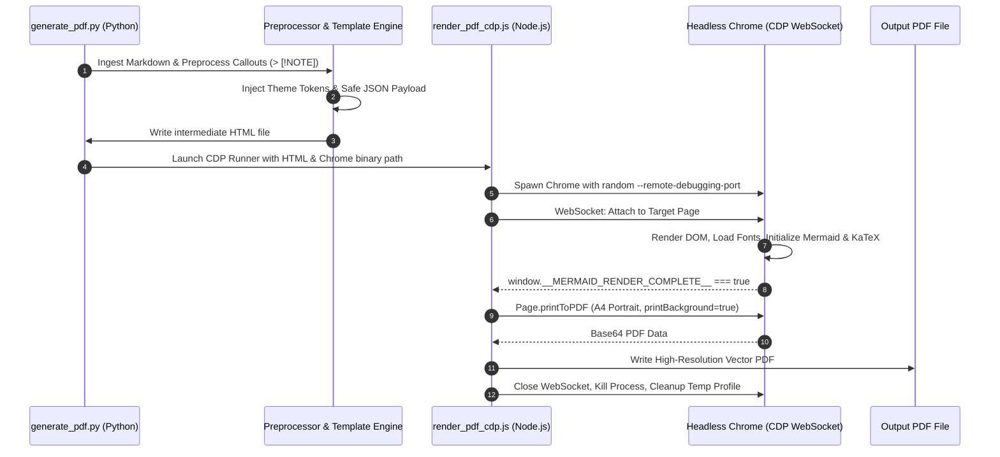

# Enterprise Solution Blueprint & Architecture Documentation Generator

[](https://cloud.google.com)
[](https://github.com/google/agent-development-kit)
[](https://mermaid.js.org)
[](https://katex.org)
[](https://chromedevtools.github.io/devtools-protocol/)
[](#prerequisites--installation)

> **The enterprise standard for authoring executive Solution Blueprints and compiling Markdown into publication-ready, co-branded PDF documents across Google Cloud.**

---

## Table of Contents

- [Overview & The Problem](#overview--the-problem)
- [Key Capabilities](#key-capabilities)
- [Architecture & Rendering Pipeline](#architecture--rendering-pipeline)
- [Prerequisites & Quick Start](#prerequisites--quick-start)
- [CLI Reference & Theme Options](#cli-reference--theme-options)
- [The 6-Section Blueprint Standard](#the-6-section-blueprint-standard)
- [Syntax & Formatting Extensions](#syntax--formatting-extensions)
- [Catalog of Bundled Anonymized Examples](#catalog-of-bundled-anonymized-examples)
  - [1. Siemens Work Plan Assistant ("Herbert")](#1-siemens-work-plan-assistant-herbert)
  - [2. Airbus REO Airworthiness Compliance Agent](#2-airbus-reo-airworthiness-compliance-agent)
  - [3. Airbus SB Warranty Claim Adjudication Agent](#3-airbus-sb-warranty-claim-adjudication-agent)
- [Publishing & Sharing across Google Cloud (`cloud-gtm`)](#publishing--sharing-across-google-cloud-cloud-gtm)
- [Automated Verification & Tests](#automated-verification--tests)

---

## Overview & The Problem

When Google Cloud Customer Engineers (CEs), AI Specialists, and Solution Architects partner with strategic enterprise customers (e.g., **Siemens, Airbus, automotive manufacturers, healthcare systems, and tier-1 financial institutions**), technical deliverables must bridge two worlds:

1. **Executive Presentation**: Polished typography, corporate co-branding, clear ROI, and high-level architectural summaries suitable for Chief Digital Officers and VP-level stakeholders.
2. **Deep Technical Rigor**: Mathematical formulations, entity-relationship data schemas, deterministic vs. LLM cognitive pipelines, lifecycle interceptors, and audited test evidence.

### Why Standard Markdown-to-PDF Tools Fail
Traditional CLI converters (such as Pandoc, Weasyprint, or basic browser print shortcuts) suffer from chronic rendering issues:
- **Clipped or Missing Mermaid Diagrams**: Diagrams are either skipped or printed before JavaScript finishes calculating SVG bounding boxes, resulting in chopped labels or truncated nodes.
- **Blurry Rasterization**: External image rendering services produce low-resolution, non-searchable bitmap images instead of crisp vector graphics.
- **Broken Math Equations**: LaTeX formulas fail to render or break when underscores conflict with Markdown italics.
- **Clumsy Pagination**: Page breaks slice diagrams, tables, and callout boxes across page boundaries.

**This skill solves these problems completely.** It pairs a disciplined 6-section blueprint authoring standard with a deterministic, Chrome DevTools Protocol (CDP) WebSocket rendering pipeline that waits for client-side DOM completion before printing.

---

## Key Capabilities

- **Native In-DOM Vector Rendering**: In-browser rendering of Mermaid flowcharts, sequence diagrams, state machines, and ER diagrams—fully scalable with selectable text.
- **KaTeX Mathematical Typesetting**: Full LaTeX equation support for both inline (`$S(Q, T)$`) and display blocks (`$$...$$`).
- **Deterministic CDP WebSocket Synchronization**: Headless Chrome rendering with DOM completion polling (`window.__MERMAID_RENDER_COMPLETE__ === true`), eliminating race conditions.
- **Enterprise Co-Branding**: Dynamic CSS custom property theming and dual-badge headers for Google Cloud + Enterprise Partner branding.
- **Built-in Brand Presets**: Pre-configured palettes for **Siemens** (Petrol & Orange), **Airbus** (Navy & Gold), **Automotive** (Carbon & Crimson), **Healthcare** (Teal & Mint), and **Finance** (Emerald & Blue).
- **GitHub Callout Cards**: Automatic preprocessing of `> [!NOTE]`, `> [!TIP]`, `> [!IMPORTANT]`, `> [!WARNING]`, and `> [!CAUTION]`.
- **KPI Summary Grid**: 4-card metric highlight block designed for executive summaries.
- **Print Optimization**: A4 portrait geometry with CSS `@page` styling, avoiding orphan headings and broken table rows.
- **Universal OS Support**: Auto-discovers Chrome/Chromium binaries across macOS, Linux (Debian, Ubuntu, Cloudtop, Cloud Shell), and Windows.

---

## Architecture & Rendering Pipeline

The generation pipeline orchestrates Python preprocessing with Node.js Chrome DevTools Protocol automation:



---

## Prerequisites & Quick Start

### System Requirements
1. **Python 3.9+** (Standard library only; no pip dependencies required for PDF generation).
2. **Node.js 18+** or **22+** (Uses native `fetch` and `WebSocket`; zero npm installs needed).
3. **Google Chrome**, **Chromium**, or **Microsoft Edge** installed.

### 1-Minute Quick Start

```bash
# 1. Clone or copy into your project
cd enterprise-blueprint-docs

# 2. Convert any Markdown file to PDF
python3 scripts/generate_pdf.py resources/blueprint_template.md output/MY_BLUEPRINT.pdf

# 3. Convert with a specific corporate partner theme
python3 scripts/generate_pdf.py my_doc.md --theme siemens
python3 scripts/generate_pdf.py my_doc.md --theme airbus
```

---

## CLI Reference & Theme Options

```
usage: generate_pdf.py [-h] [-i OPT_INPUT] [-o OPT_OUTPUT] [--html HTML]
                       [--title TITLE] [--theme {default,siemens,airbus,automotive,healthcare,finance}]
                       [--partner PARTNER] [--partner-color PARTNER_COLOR]
                       [--badge BADGE] [--chrome-bin CHROME_BIN] [--no-pdf]
                       [-v] [input_file] [output_file]
```

### Options Description

| Parameter | Type | Default | Description |
| :--- | :---: | :---: | :--- |
| `input_file`, `-i`, `--input` | Path | Required | Path to the source Markdown document (`.md`). |
| `output_file`, `-o`, `--output`| Path | `<input>.pdf`| Destination path for the generated PDF. |
| `--theme` | Choice | `default` | Built-in brand palette (`default`, `siemens`, `airbus`, `automotive`, `healthcare`, `finance`). |
| `--partner` | String | *Theme Default* | Co-branding partner name displayed on the right header. |
| `--partner-color` | Hex | *Theme Default* | Primary hex color code for headings and partner badges (e.g., `#00646e`). |
| `--badge` | String | *Theme Default* | Subtitle badge for partner domain (e.g., `Teamcenter PLM`). |
| `--title` | String | *From H1* | Override document title in window metadata and header. |
| `--html` | Path | `<input>.html`| Output path for intermediate HTML file. |
| `--no-pdf` | Flag | `false` | Generate standalone HTML presentation only (skips PDF print). |
| `--chrome-bin` | Path | *Auto* | Explicit path to Chrome or Chromium executable. |
| `-v`, `--verbose` | Flag | `false` | Enable verbose diagnostic logging. |

### Built-in Brand Palettes

| Preset | Partner Name | Primary Color | Accent Color | Intended Domain |
| :--- | :--- | :--- | :--- | :--- |
| `default` | Enterprise Solution | `#1a73e8` (GCP Blue) | `#f9ab00` (Amber) | General Google Cloud Reference Architectures |
| `siemens` | SIEMENS | `#00646e` (Petrol) | `#eb780a` (Orange) | PLM, MES, Digital Industries, Industrial Automation |
| `airbus` | AIRBUS | `#00205b` (Deep Navy)| `#f2a900` (Gold) | Commercial Aerospace, Airworthiness, Defense |
| `automotive`| Automotive OEM | `#1e2229` (Carbon) | `#c8102e` (Crimson) | Connected Vehicle, Manufacturing, Supply Chain |
| `healthcare`| Digital Health | `#007a87` (Teal) | `#ff5a5f` (Coral) | Clinical AI, MedTech, Regulated Life Sciences |
| `finance` | Financial Services| `#0f5132` (Emerald) | `#ffc107` (Gold) | Sovereign Banking, Risk Analysis, FinTech Core |

---

## The 6-Section Blueprint Standard

To ensure structural consistency across Google Cloud enterprise deliverables, all blueprints should follow the 6-section structure outlined in `resources/blueprint_template.md`:

```
Section 1: Header & Executive Metadata
  ├── Co-branded header bar (Google Cloud + Partner)
  └── Executive metadata table (Target Platform, Model, Region, Data Architecture)

Section 2: Executive Summary & High-Level ROI
  ├── Executive summary narrative and business problem statement
  ├── 4-card KPI metric highlight grid (Speed, Accuracy, Data Governance, Channels)
  └── High-level system architecture flowchart (Mermaid)

Section 3: Core Technical Specifications & Cognitive Pipeline
  ├── Requirements & compliance matrix table
  ├── Cognitive execution tiers: Deterministic Tier vs. Multimodal LLM Tier
  └── Pydantic schema validation contracts and domain taxonomies

Section 4: Mathematical Modeling & Algorithmic Formulations
  ├── Objective function or similarity formulations (KaTeX)
  ├── Discrete multiset calculations vs. dense embedding trade-offs
  └── Parameter calibration and penalty constants (α, β weights)

Section 5: Enterprise Governance & Auditability
  ├── ADK 2.0 lifecycle plugins (before_tool, after_tool, on_error)
  ├── Immutable session audit trail (context.state["audit_history"])
  └── Observability telemetry (Cloud Trace, OpenTelemetry waterfall diagrams)

Section 6: Deployment & Verification Evidence
  ├── Automated test evaluation matrix (Unit, Regression, Golden Eval Sets)
  ├── CLI execution & Vertex AI Reasoning Engine deployment scripts
  └── Gemini Enterprise Agentspace registration payload
```

---

## Syntax & Formatting Extensions

### 1. GitHub Callouts to Google Cloud Alert Cards
Standard GitHub callouts are automatically transformed into styled border-accented alert cards:

```markdown
> [!NOTE]
> Architecture statement or general technical context.

> [!TIP]
> Recommended practice or performance optimization.

> [!IMPORTANT]
> Mandatory compliance rule, airworthiness invariant, or security requirement.

> [!WARNING]
> Operational caveat, migration notice, or quota limitation.

> [!CAUTION]
> High-risk action, critical discrepancy, or potential data loss warning.
```

### 2. Explicit Page Breaks
Keep PDF sections clean by inserting explicit page breaks before new chapters:
```markdown
<div class="page-break"></div>
<!-- or simply -->
<!-- pagebreak -->
```

### 3. Executive KPI Metric Grid
Create a 4-card metric block for executive summaries:
```markdown
| ⚡ In-Database Speed | 🎯 Mathematical Precision | 🔒 Zero-Copy Data Lakehouse | 🌐 Multi-Channel Integration |
| :---: | :---: | :---: | :---: |
| **< 200 ms Query**<br/>for 35,000+ plans | **100% Deterministic**<br/>Asymmetric Tversky Index | **S3 Apache Iceberg**<br/>BigQuery External Tables | **Gemini Enterprise & CLI**<br/>Native chat integration |
```

---

## Catalog of Bundled Anonymized Examples

This repository includes three complete, anonymized enterprise solution blueprints harvested from production customer engagements:

### 1. Siemens Work Plan Assistant ("Herbert")
- **Location:** [`examples/siemens-work-plan-assistant/WORK_PLAN_ASSISTANT_BLUEPRINT.md`](file:///Users/ollesch/julius-dev/enterprise-blueprint-docs/examples/siemens-work-plan-assistant/WORK_PLAN_ASSISTANT_BLUEPRINT.md)
- **Compiled PDF:** [`examples/siemens-work-plan-assistant/WORK_PLAN_ASSISTANT_BLUEPRINT.pdf`](file:///Users/ollesch/julius-dev/enterprise-blueprint-docs/examples/siemens-work-plan-assistant/WORK_PLAN_ASSISTANT_BLUEPRINT.pdf)
- **Theme:** `siemens` (Petrol & Orange)
- **Domain:** Industrial Electronics Manufacturing & PLM Automation (Siemens Teamcenter).
- **Core Technology:**
  - **Zero-Copy Lakehouse**: Direct SQL queries on **Apache Iceberg tables** via **BigQuery BigLake External Tables**.
  - **3-Tier Asymmetric Tversky Index**: Mathematical multiset formula prioritizing exact part matches (Tier 1 = 1.00), specification matches (Tier 2 = 0.75), and functional families (Tier 3 = 0.45) with penalties ($\alpha=0.7, \beta=0.3$).
  - **In-Database CTE**: Sub-200ms query execution across 35,000+ manufacturing routing plans.
  - **ADK 2.4 + Gemini 3.5 Flash**: Dual-mode agent handling inline free-text BOMs and part lookups.

### 2. Airbus REO Airworthiness Compliance Agent
- **Location:** [`examples/airbus-aerospace-agents/AEROSPACE_REO_COMPLIANCE_BLUEPRINT.md`](file:///Users/ollesch/julius-dev/enterprise-blueprint-docs/examples/airbus-aerospace-agents/AEROSPACE_REO_COMPLIANCE_BLUEPRINT.md)
- **Compiled PDF:** [`examples/airbus-aerospace-agents/AEROSPACE_REO_COMPLIANCE_BLUEPRINT.pdf`](file:///Users/ollesch/julius-dev/enterprise-blueprint-docs/examples/airbus-aerospace-agents/AEROSPACE_REO_COMPLIANCE_BLUEPRINT.pdf)
- **Theme:** `airbus` (Navy & Gold)
- **Domain:** Commercial Aircraft Maintenance, Fleet Support, and Airworthiness Compliance (A220 Program).
- **Core Technology:**
  - **Hybrid Cognitive Architecture**: 14 deterministic regex/structural rules (<50ms) + 9 targeted Gemini 3.7 Flash multimodal vision rules (datum orientation, grid scales, imperative grammar).
  - **24-Point Compliance Matrix**: Full mapping of aerospace engineering order checklist.
  - **ADK 2.0 Governance**: Lifecycle interceptors (`ReoComplianceAuditPlugin`) logging immutable audit records in `context.state["audit_history"]`.
  - **Telemetry Waterfall**: OpenTelemetry / Cloud Trace sequence breakdown across all 4 execution stages.

### 3. Airbus SB Warranty Claim Adjudication Agent
- **Location:** [`examples/airbus-aerospace-agents/AEROSPACE_WARRANTY_ADJUDICATION_BLUEPRINT.md`](file:///Users/ollesch/julius-dev/enterprise-blueprint-docs/examples/airbus-aerospace-agents/AEROSPACE_WARRANTY_ADJUDICATION_BLUEPRINT.md)
- **Compiled PDF:** [`examples/airbus-aerospace-agents/AEROSPACE_WARRANTY_ADJUDICATION_BLUEPRINT.pdf`](file:///Users/ollesch/julius-dev/enterprise-blueprint-docs/examples/airbus-aerospace-agents/AEROSPACE_WARRANTY_ADJUDICATION_BLUEPRINT.pdf)
- **Theme:** `airbus` (Navy & Gold)
- **Domain:** Commercial Airline Retrofit Warranty Reimbursement & Financial Reconciliation.
- **Core Technology:**
  - **Multi-Agent Coordination**: Coordinator workflow orchestrating 8 specialized subagents (claim parser, SB parser, applicability checker, task card validator, campaign policy checker, rate calculator, duplication checker, override parser).
  - **Deterministic Labor Reconciliation**: Dual-epoch formulation enforcing **Rule A** (post-2024 full actuals) vs. **Rule B** (pre-2024 standard procedure caps).
  - **Human-in-the-Loop A2UI Protocol**: Interactive v0.9 cards with 1-click action buttons (`[APPROVE OVERRIDE]`, `[PROCEED WITH SB HOURS]`, `[HOLD FOR UPLOAD]`, `[REJECT]`) in Gemini Enterprise Agentspace.
  - **Advisory Framing**: User-facing approval outcomes framed as "Suggested to Approve", preserving human statutory authority.

---

## Publishing & Sharing across Google Cloud (`cloud-gtm`)

This skill package adheres to the **Google Cloud Agent Skills specification** and is ready to be published to the internal `cloud-gtm` GitHub organization:

```bash
# 1. Initialize git repository
cd /Users/ollesch/julius-dev/enterprise-blueprint-docs
git init
git add .
git commit -m "feat: initial enterprise-blueprint-docs skill release with Siemens and Airbus examples"

# 2. Create remote repository under cloud-gtm
~/ge_spark_workspace/ce-powers-spark/bin/gh-cli repo create cloud-gtm/enterprise-blueprint-docs \
  --private \
  --description "Enterprise Solution Blueprint & Architecture Documentation Generator for Google Cloud AI Engineering"

# 3. Push main branch
git branch -M main
git remote add origin git@github.com:cloud-gtm/enterprise-blueprint-docs.git
git push -u origin main
```

### Installation by Other Customer Engineers
Colleagues can install this skill into their environment with a single command via the `install-skill` workflow:
```bash
# In Gemini CLI or Jetski session:
"install the enterprise-blueprint-docs skill from cloud-gtm"
```

---

## Automated Verification & Tests

A comprehensive unit test suite is included in `tests/test_pipeline.py`. It tests:
1. GitHub alert callout preprocessing (`> [!NOTE]` $\rightarrow$ HTML cards).
2. Explicit page break tag parsing.
3. H1 document title extraction.
4. Cross-platform Chrome/Chromium binary discovery.
5. HTML template token substitution and Mermaid/KaTeX runtime script injection.
6. End-to-end PDF generation on a synthetic Markdown sample.

Run the test suite with:
```bash
python3 tests/test_pipeline.py
```

Expected output:
```
Ran 6 tests in 13.977s

OK
```

---

## Directory Structure

```
enterprise-blueprint-docs/
├── SKILL.md                          # Agent Skill specification (Google Cloud / agentskills.io)
├── README.md                         # Executive overview, CLI docs, and publishing guide
├── plugin.json                       # Jetski / Gemini CLI plugin metadata
├── scripts/
│   ├── generate_pdf.py               # Main CLI runner (Python)
│   ├── render_pdf_cdp.js             # Chrome DevTools Protocol renderer (Node.js)
│   ├── pdf_to_images.py              # Cross-platform PDF-to-PNG preview converter
│   └── pdf_to_images.swift           # Native macOS PDFKit rasterizer (Swift)
├── resources/
│   ├── blueprint_template.md         # 6-section enterprise blueprint template
│   └── theme_presets.json            # Color palettes (Siemens, Airbus, Auto, Health, Finance)
├── examples/
│   ├── siemens-work-plan-assistant/
│   │   ├── WORK_PLAN_ASSISTANT_BLUEPRINT.md   # Anonymized Siemens PLM blueprint
│   │   ├── WORK_PLAN_ASSISTANT_BLUEPRINT.html # Pre-rendered HTML
│   │   └── WORK_PLAN_ASSISTANT_BLUEPRINT.pdf  # Compiled high-resolution PDF (831 KB)
│   └── airbus-aerospace-agents/
│       ├── AEROSPACE_REO_COMPLIANCE_BLUEPRINT.md          # Anonymized REO audit blueprint
│       ├── AEROSPACE_REO_COMPLIANCE_BLUEPRINT.html        # Pre-rendered HTML
│       ├── AEROSPACE_REO_COMPLIANCE_BLUEPRINT.pdf         # Compiled PDF (844 KB)
│       ├── AEROSPACE_WARRANTY_ADJUDICATION_BLUEPRINT.md   # Anonymized SB warranty blueprint
│       ├── AEROSPACE_WARRANTY_ADJUDICATION_BLUEPRINT.html # Pre-rendered HTML
│       └── AEROSPACE_WARRANTY_ADJUDICATION_BLUEPRINT.pdf  # Compiled PDF (706 KB)
└── tests/
    └── test_pipeline.py              # Automated unit and integration test suite
```

---

## Authors & Maintenance

- **Author:** Google Cloud AI Engineering
- **Version:** `1.2.0`
- **Maintained by:** Google Cloud Customer Engineering & CE Powers Spark Team
- **Feedback & Issues:** File issues or contributions via `cloud-gtm/enterprise-blueprint-docs`.
