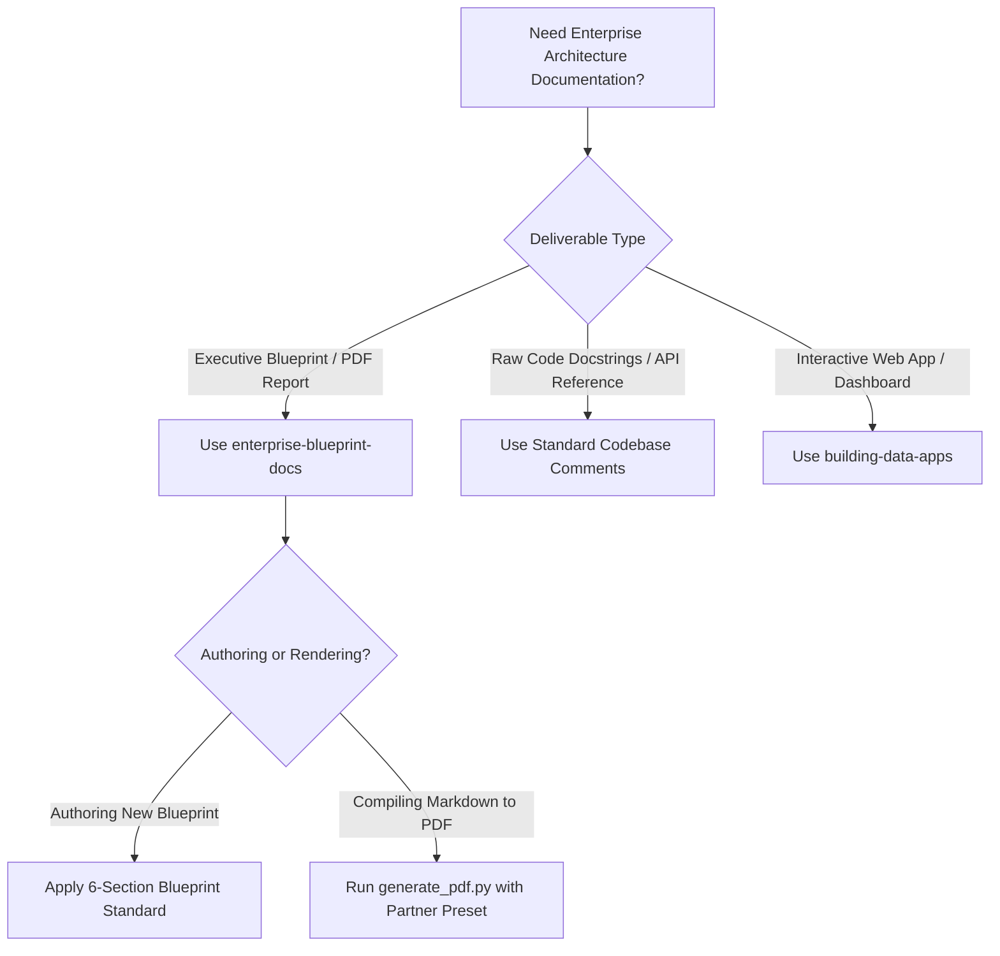
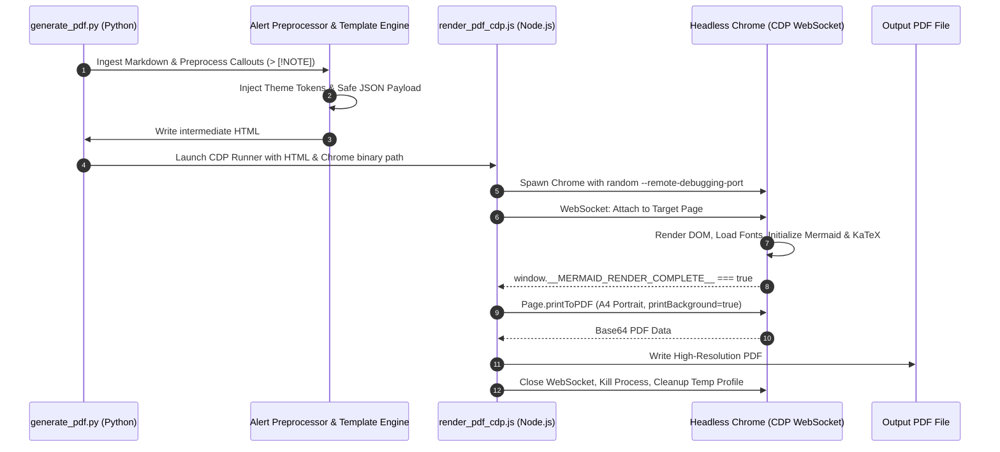

# Enterprise Solution Blueprint & Markdown-to-PDF Generation

This skill establishes the production standard for authoring executive Solution Blueprints and compiling Markdown into publication-ready, co-branded PDF documents for Google Cloud enterprise engagements.

## Overview & Core Capabilities

Enterprise customer engagements (such as Industry manufacturing, Aircraft fleet operations, Automotive OEMs, healthcare providers, and global financial institutions) require documentation that matches Google Cloud's corporate visual quality while communicating deep technical rigor:

1. **Structured Blueprint Framework**: Standardized 6-section blueprint specification covering executive context, hybrid deterministic/LLM cognitive architectures, Pydantic schemas, data models, ADK 2.0 governance plugins, and test evidence.
2. **Native In-DOM Rendering**: Vector rendering of Mermaid flowcharts, sequence diagrams, state machines, and KaTeX mathematical equations directly within the DOM—eliminating blurry rasterized images or external rendering web services.
3. **Deterministic Chrome DevTools Protocol (CDP)**: Headless browser automation via WebSocket polling for `window.__MERMAID_RENDER_COMPLETE__`, guaranteeing zero clipped nodes, incomplete layout passes, or broken diagrams.
4. **Co-Branded Styling**: Dynamic CSS custom properties and badge headers supporting Google Cloud + Enterprise Partner branding (Industry, Aircraft, Automotive, Healthcare, Finance, or custom HEX codes).
5. **Cross-Platform Portability**: Automated binary discovery across macOS, Linux (Debian, Ubuntu, Cloud Shell, Cloudtop), and Windows.

---

## When to Use



### Apply this skill when:
- Authoring an executive Solution Blueprint, Architecture Decision Record (ADR), or PoC summary for an enterprise client.
- Documenting complex hybrid AI architectures combining deterministic rule engines and multimodal LLMs.
- Converting Markdown documents containing Mermaid diagrams, KaTeX mathematical formulas, and table grids into high-resolution PDFs.
- Preparing co-branded presentation materials for Customer Engineering (CE) presentations, Technical Advisory Boards, or Executive Briefing Centers (EBC).

### Do NOT use when:
- Writing internal scratch notes or quick personal READMEs.
- Creating slide deck presentations (use PPTX or Slides tooling).
- Building frontend user interfaces (use `building-data-apps`).

---

## 1. Solution Blueprint Document Standard

When authoring a solution blueprint (e.g. `docs/PROJECT_BLUEPRINT.md` or from `resources/blueprint_template.md`), structure it according to the six standard enterprise sections:

### Section 1: Executive Information & Document Metadata
- Co-branded header bar with Partner Name and Google Cloud badging.
- Executive summary table: Client/Domain, Solution Category, Technology Stack, Target Platform, Data Architecture, Hosting Region, Status, and Date.

### Section 2: Executive Summary & System Highlights
- Business context, problem statement, and high-level ROI.
- **KPI Summary Grid**: 4-card metric highlight block displaying speed, accuracy, data governance, and integration capabilities:
  ```markdown
  | ⚡ In-Database Speed | 🎯 Mathematical Precision | 🔒 Zero-Copy Data Lakehouse | 🌐 Multi-Channel Integration |
  | :---: | :---: | :---: | :---: |
  | **< 200 ms Query**<br/>for 35,000+ plans | **100% Deterministic**<br/>Asymmetric Tversky Index | **S3 Apache Iceberg**<br/>BigQuery External Tables | **Gemini Enterprise & CLI**<br/>Native chat integration |
  ```
- End-to-End System Architecture Diagram using Mermaid flowchart/subgraphs.

### Section 3: Core Technical Specifications & Cognitive Pipeline
- Detailed mapping of requirements and compliance matrix.
- Hybrid cognitive split: **Deterministic Tier** (regex, syntax, structural ranges) vs. **Targeted Multimodal LLM Tier** (visual drawings, spatial datums, imperative grammar).
- Pydantic schema validation contracts and domain taxonomies.

### Section 4: Mathematical Modeling & Algorithmic Formulations
- Rigorous mathematical formulations rendered with KaTeX syntax:
  ```markdown
  $$
  S(Q, T) = \frac{\text{Matched Mass}}{\text{Matched Mass} + \alpha \cdot \text{Missing Mass} + \beta \cdot \text{Extra Mass}}
  $$
  ```
- Clear explanations of weighting parameters, scoring penalties, and algorithmic trade-offs.

### Section 5: Enterprise Governance & Auditability
- ADK 2.0 Plugins extending `BasePlugin` (`before_tool_callback`, `after_tool_callback`, `on_tool_error_callback`).
- Immutable session audit trails (`context.state["audit_history"]`).
- Cloud Storage artifact persistence and Cloud Trace / OpenTelemetry telemetry waterfall.

### Section 6: Deployment & Verification Evidence
- Automated test evaluation matrices (unit, regression, evaluation sets).
- CLI and cloud deployment commands (`adk run`, `ReasoningEngine.create`).
- Gemini Enterprise Agentspace registration payload and endpoints.

---

## 2. Markdown-to-PDF Generation Architecture

The PDF rendering pipeline uses a two-tier coordinated engine:



---

## 3. Quick Start & CLI Usage

### Basic Usage
Convert any Markdown document to PDF with default Google Cloud styling:
```bash
python3 scripts/generate_pdf.py docs/SOLUTION_BLUEPRINT.md docs/SOLUTION_BLUEPRINT.pdf
```

### Using Partner Themes
```bash
# Industry Theme (Petrol / PLM Automation)
python3 scripts/generate_pdf.py docs/INDUSTRY_BLUEPRINT.md --theme industry

# Aircraft Theme (Navy & Gold / Fleet Support)
python3 scripts/generate_pdf.py docs/AIRCRAFT_BLUEPRINT.md --theme aircraft

# Custom Corporate Partner
python3 scripts/generate_pdf.py docs/PARTNER_DOC.md \
  --partner "Acme Corp" \
  --partner-color "#800020" \
  --badge "Smart Factory"
```

### Full Options Reference
| Flag | Description | Default |
| :--- | :--- | :--- |
| `-i, --input` | Path to source Markdown file | Required |
| `-o, --output` | Path to destination PDF file | `<input>.pdf` |
| `--theme` | Built-in theme preset (`default`, `industry`, `aircraft`, `automotive`, `healthcare`, `finance`) | `default` |
| `--partner` | Custom partner brand name | Preset default |
| `--partner-color`| Custom primary brand hex code | Preset default |
| `--badge` | Custom partner subtitle badge | Preset default |
| `--title` | Override document title in header | Auto-extracted from first H1 |
| `--html` | Custom path for intermediate HTML | `<input>.html` |
| `--no-pdf` | Generate HTML preview only (skip PDF) | `false` |
| `--chrome-bin` | Explicit path to Chrome/Chromium binary | Auto-detected |
| `-v, --verbose` | Enable debug and diagnostic output | `false` |

---

## 4. Syntax & Styling Extensions

### 1. GitHub Callout Alerts
Converts standard GitHub alert syntax into styled Google Cloud cards:
```markdown
> [!NOTE]
> Informational note or architectural context.

> [!TIP]
> Practical recommendation or performance optimization.

> [!IMPORTANT]
> Critical compliance invariant or mandatory requirement.

> [!WARNING]
> Operational caveat, deprecation, or limitation.

> [!CAUTION]
> Safety-critical rule or potential data integrity issue.
```

### 2. Explicit Page Breaks
Force page breaks before major headings in print and PDF outputs:
```markdown
<div class="page-break"></div>
<!-- or -->
<!-- pagebreak -->
```

### 3. KPI Highlight Grid
```markdown
| ⚡ Metric 1 | 🎯 Metric 2 | 🔒 Metric 3 | 🌐 Metric 4 |
| :---: | :---: | :---: | :---: |
| **< 200 ms**<br/>Latency | **100%**<br/>Accuracy | **Zero-Copy**<br/>Lakehouse | **Multi-Channel**<br/>Chat & API |
```

---

## 5. Common Mistakes & Troubleshooting

| Issue | Root Cause | Solution |
| :--- | :--- | :--- |
| **Diagrams clipped or unrendered** | Print triggered before client-side rendering finished | `render_pdf_cdp.js` automatically waits for `window.__MERMAID_RENDER_COMPLETE__ === true`. Ensure you have Node.js 18+ installed. |
| **Chrome not found error** | Chrome/Chromium is installed in non-standard path | Specify `--chrome-bin /path/to/chrome` or set `export CHROME_BIN=/path/to/chrome`. |
| **KaTeX formula broken** | Underscores or dollar signs inside code blocks | KaTeX delimiters `$..$` are ignored inside backtick code blocks and `<pre>` tags. Use `$$` for display math and `$` for inline math. |
| **Mermaid font overlapping** | System fonts were not ready when SVG rendered | Script awaits `document.fonts.ready` before measuring text dimensions. |
| **Linux headless issues in Docker** | Missing sandbox or display flags | Script automatically passes `--no-sandbox`, `--disable-gpu`, and `--headless=new`. |
