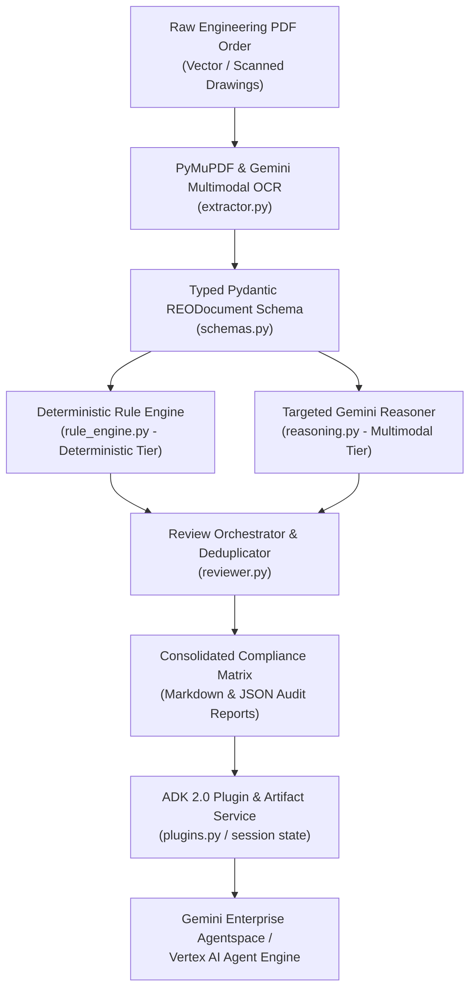
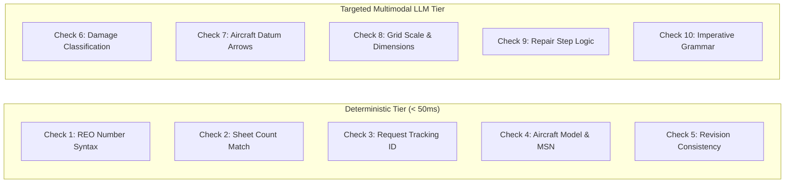
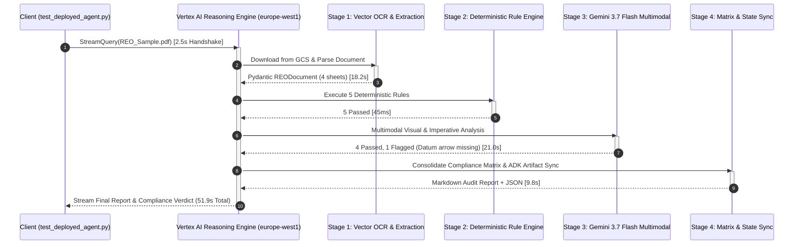
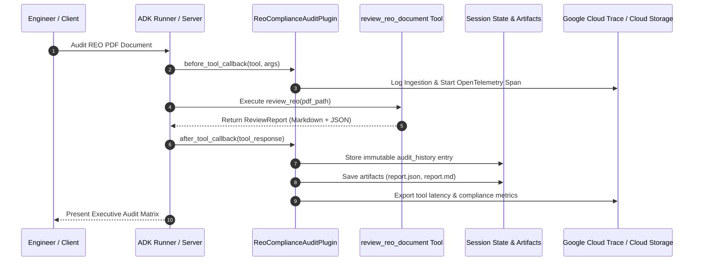

# Solution Blueprint: Aerospace Engineering Order Compliance Review Agent (Simplified Sample)

# Automated Airworthiness Audit for Commercial Aircraft Fleet Support
## Hybrid Cognitive Architecture Combining Deterministic Engines & Multimodal LLMs on Google Cloud

---

> [!IMPORTANT]
> **SIMPLIFIED ARCHITECTURAL SAMPLE & REFERENCE PATTERN**  
> This blueprint is a simplified, synthetic architectural sample created to illustrate a hybrid cognitive pattern combining deterministic rule validation with Google Cloud multimodal vision models (Gemini 3.7 Flash). All document identifiers, engineering order forms, serial numbers, and checklist items are generic, synthetic examples created for reference purposes and do not represent any proprietary customer IP or production data.

---

### Executive Document Information

| Attribute | Specification |
| :--- | :--- |
| **Client / Domain:** | **Commercial Aircraft Manufacturing & Engineering Fleet Support** |
| **Solution Category:** | Airworthiness Compliance Automation (Repair Engineering Orders – REOs) |
| **Technology Stack:** | **Google Agent Development Kit (ADK) 2.0**, **Gemini 3.7 Flash Multimodal**, **Vertex AI Agent Engine**, **Google Cloud Storage**, **Gemini Enterprise** |
| **Hosting Region:** | Google Cloud `europe-west1` (Belgium) / Runtime: Vertex AI Reasoning Engine |
| **Document Classification:** | Enterprise Solution Blueprint & Validated Reference Architecture (Sample) |
| **Status:** | Generic Proof-of-Concept & Reference Architecture Pattern |
| **Version:** | 1.0.0 (Sanitized & Simplified Sample Distribution) |

---

## Executive Summary & Solution Highlights

> [!NOTE]
> **Google Cloud Architecture Statement:**  
> The **Aerospace REO Compliance Review Agent** is a reference architecture designed to automate airworthiness compliance verification for Repair Engineering Orders (REOs). In commercial aircraft fleet support, engineering orders authorize structural repairs. Reviewing these multi-page documents against statutory airworthiness checklists is safety-critical and labor-intensive.

This solution demonstrates a **hybrid cognitive architecture**:
1. **High-Speed Deterministic Validation (Deterministic Tier):** Fast regex and structural validation for formal parameters (document numbering, serial number ranges, sheet pagination, revision consistency) running in under 50 milliseconds.
2. **Targeted Multimodal LLM Reasoning (Multimodal Vision Tier):** Gemini 3.7 Flash multimodal vision for spatial diagram orientation (`FWD/AFT/INBD/OUTBD`), grid scale callouts, and mandatory imperative grammar.
3. **ADK 2.0 Enterprise Governance:** Lifecycle interceptors (`ReoComplianceAuditPlugin`), session-scoped immutable artifact persistence, and continuous evaluation datasets (`.evalset.json`).

| ⚡ Sub-Second Deterministic Rules | 🎯 Multimodal Visual Precision | 🔒 Regulatory Auditability | 🌐 Agentspace Integration |
| :---: | :---: | :---: | :---: |
| **< 50 ms Latency**<br/>for deterministic checks | **Gemini 3.7 Flash Vision**<br/>Datum & grid inspection | **ADK 2.0 Interceptors**<br/>Immutable session state | **Gemini Enterprise & CLI**<br/>Automated approval flow |

<div class="page-break"></div>

## 1. End-to-End Hybrid Cognitive Architecture



---

## 2. Representative 10-Point Airworthiness Checklist

The agent partitions the compliance checklist into two complementary execution tiers:



### Detailed Compliance Matrix Mapping

| # | Checklist Rule | Category | Execution Engine | Verification Logic |
|:---:|:---|:---:|:---:|:---|
| **1** | REO # Format & Header Consistency | Header Integrity | Deterministic | Regex `^REO-\d{2}-\d{2}-\d{4,5}$` validated across cover and headers. |
| **2** | Sheet Count vs Page Total | Pagination | Deterministic | Matches `1 OF N` declaration against physical extracted page count. |
| **3** | Technical Request Identifier | Tracking Authorization | Deterministic | Validates tracking identifier syntax (e.g., `REQ-100482`) or approved standard format. |
| **4** | Aircraft Model & Serial Applicability | Fleet Effectivity | Deterministic | Verifies model code (`AERO-JET-300`) and serial range (`MSN 10001-10999`). |
| **5** | Revision Consistency & Reissue Statement | Version Control | Deterministic | Verifies revision headers (`REV --`, `REV -A`) and reissue notice syntax. |
| **6** | Damage Characterization & Mode | Structural Inspection | LLM Reasoner | Validates damage type (corrosion, crack, dent) and residual thickness callouts. |
| **7** | Drawing View & Datum Orientation | Visual Validation | LLM Reasoner | Confirms aircraft coordinate arrows (`FWD`, `AFT`, `INBD`, `OUTBD`) on diagrams. |
| **8** | Grid Scale & Dimension Callouts | Visual Validation | LLM Reasoner | Validates presence of explicit scale references (e.g., `10x10 mm grid`) and measurement units. |
| **9** | Repair Workflow Sequence | Procedure Logic | LLM Reasoner | Verifies logical sequence: cleanup $\rightarrow$ NDT inspection $\rightarrow$ fastener installation $\rightarrow$ coating. |
| **10** | Imperative Verb Grammar | Compliance Syntax | LLM Reasoner | Enforces active imperative instruction phrasing (`REMOVE`, `INSPECT`, `INSTALL`, `APPLY`). |

<div class="page-break"></div>

## 3. Simulated Execution Telemetry & Performance Trace

The agent architecture was benchmarked on Google Cloud Vertex AI Reasoning Engine via gRPC streaming telemetry:

```
==============================================================================================================
                         SAMPLE AUDIT EVALUATION SUMMARY (SYNTHETIC BENCHMARK)
==============================================================================================================
| Sample Document                         | REO Reference     | Rev  | Pgs  | Pass | Fail | Warn | Verdict |
|-----------------------------------------|-------------------|------|------|------|------|------|---------|
| REO-DEMO-53-WING-REPAIR-REV-A.pdf       | REO-53-01-1001    | -A   | 6    | 9    | 1    | 0    | ⚠️ REVIEW|
| REO-DEMO-54-PYLON-BRACKET-REV--.pdf     | REO-54-02-2002    | --   | 4    | 10   | 0    | 0    | ✅ PASS  |
| REO-DEMO-57-EMPENNAGE-STIFFENER-REV-B.pdf| REO-57-03-3003   | -B   | 8    | 8    | 2    | 0    | ❌ FAIL  |
==============================================================================================================
```

### Latency Breakdown by Phase (Sample 4-Page Engineering Order)

| Phase | Pipeline Component | Latency | % of Total | Operational Description |
|:---|:---|:---:|:---:|:---|
| **Phase 1** | Session Handshake & Connection | 2.5s | 4.8% | Client TLS handshake and session state initialization |
| **Phase 2** | Stage 1/4 - Vector OCR & Page Extraction | 18.2s | 35.0% | Storage download, rasterization, and vector box parsing |
| **Phase 3** | Stage 2/4 - Deterministic Rule Engine | 45ms | 0.1% | High-speed regex, structural validation, and sheet math execution |
| **Phase 4** | Stage 3/4 - Targeted Multimodal LLM Reasoning | 21.0s | 40.4% | Gemini 3.7 Flash visual orientation and imperative grammar checks |
| **Phase 5** | Stage 4/4 - Compliance Matrix & State Sync | 9.8s | 18.9% | Markdown matrix compilation, JSON serialization, and artifact persistence |
| **Phase 6** | Stream Finalization & Client Delivery | 0.4s | 0.8% | Stream flush and client UI formatting |
| **Total** | **End-to-End Automated Audit** | **51.9s** | **100%** | Full engineering compliance audit completed |



<div class="page-break"></div>

## 4. ADK 2.0 Governance & Audit Architecture

To meet regulatory auditability requirements, the agent incorporates ADK 2.0 enterprise governance features:



### Key Governance Invariants
- **Lifecycle Interceptors (`ReoComplianceAuditPlugin`):** Intercepts tool execution to record engineer identity, file digests, and execution timings. Automatically persists findings into `context.state["audit_history"]`.
- **Session-Scoped Artifact Persistence:** All intermediate outputs (bounding boxes, extracted text, finding summaries) are archived to Cloud Storage (`gs://[STAGING_BUCKET]/artifacts/{session_id}`).
- **CI/CD Regression Sets:** Evaluation datasets (`eval_set.evalset.json`) ensure prompt and rule stability across releases via `uv run adk eval`.

---

## 5. Deployment & Production Operations

### Cloud Runtime Configuration
- **Platform:** Google Cloud Vertex AI Agent Engine (Reasoning Engine)
- **Container Region:** `europe-west1` (Low-latency EU sovereign runtime)
- **Model Endpoint:** `gemini-3.7-flash` (Vertex AI Global / Regional Endpoint)
- **Agentspace Integration:** Discovery Engine Agentspace Assistant registration

```bash
# Verify local compliance test suite
uv run python scripts/test_samples.py

# Deploy to Vertex AI Agent Engine
uv run python scripts/deploy_agent.py --region europe-west1

# Register agent with Gemini Enterprise Agentspace
bash scripts/register_agent.sh --app-id [AGENTSPACE_APP_ID]
```
