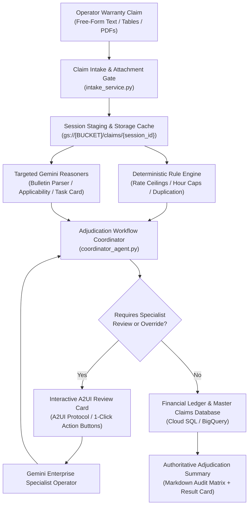
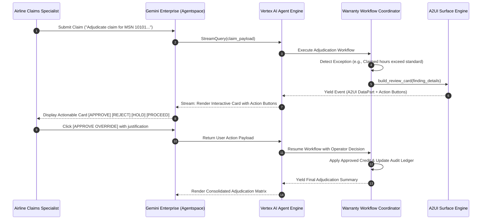

# Solution Blueprint: Aerospace Service Bulletin Warranty Adjudication Agent (Simplified Sample)

# Automated Warranty Claim Adjudication for Commercial Aircraft Fleets
## Multi-Agent Cognitive Architecture with Human-in-the-Loop A2UI Surfaces on Google Cloud

---

> [!IMPORTANT]
> **SIMPLIFIED ARCHITECTURAL SAMPLE & REFERENCE PATTERN**  
> This blueprint is a simplified, synthetic architectural sample created to illustrate a multi-agent cognitive pattern with interactive human-in-the-loop A2UI surfaces on Google Cloud. All commercial contract terms, airline identifiers, service bulletin codes, and labor reimbursement policies are generic, synthetic examples created for reference purposes and do not represent any proprietary customer IP or production data.

---

### Executive Document Information

| Attribute | Specification |
| :--- | :--- |
| **Client / Domain:** | **Commercial Aircraft Manufacturing & Fleet Support** |
| **Solution Category:** | Warranty Claim Adjudication & Financial Reconciliation Automation |
| **Technology Stack:** | **Google Agent Development Kit (ADK) 2.0**, **Gemini 3.5 Flash**, **Vertex AI Agent Engine**, **A2UI Protocol v0.9**, **Gemini Enterprise** |
| **Data Architecture:** | **Cloud SQL PostgreSQL Ledger** + **Cloud Storage MD5 Cache** + **Master Claims Database** |
| **Hosting Region:** | Google Cloud `europe-west1` (Belgium) / Runtime: Vertex AI Reasoning Engine |
| **Document Classification:** | Enterprise Solution Blueprint & Validated Reference Architecture (Sample) |
| **Status:** | Generic Proof-of-Concept & Reference Architecture Pattern |
| **Version:** | 1.0.0 (Sanitized & Simplified Sample Distribution) |

---

## Executive Summary & Solution Highlights

> [!NOTE]
> **Google Cloud Architecture Statement:**  
> The **Aerospace Service Bulletin (SB) Warranty Adjudication Agent** is a reference architecture engineered to automate and govern the warranty reimbursement lifecycle for commercial aircraft fleets. When manufacturers publish Service Bulletins for technical modifications, airline operators perform maintenance retrofits and submit warranty reimbursement claims for documented labor and materials.

Adjudicating warranty claims requires multi-factor compliance verification:
1. **Airframe Applicability:** Confirming claimant aircraft Manufacturer Serial Numbers (MSNs) fall within the designated applicability ranges.
2. **Warranty & Campaign Policy:** Validating airframe warranty status or eligibility under a Commercial Campaign Notice (CCN).
3. **Task Card Verification:** Cross-referencing maintenance records to confirm aircraft registration, embodiment dates, and recorded technician hours.
4. **Labor Rate & Hours Reconciliation:** Applying contractual labor rate ceilings and enforcing procedure hour allowances.
5. **Anti-Duplication Ledger:** Preventing duplicate claim submissions against historical transaction records.
6. **Human-in-the-Loop Governance:** Providing warranty specialists with interactive A2UI review cards directly in Gemini Enterprise.

| ⚡ 15-Second Adjudication | 🎯 Deterministic Hours Reconciliation | 🔒 Anti-Duplication Protection | 🌐 Interactive A2UI Surfaces |
| :---: | :---: | :---: | :---: |
| **From 60 min to <15s**<br/>per claim dossier | **Dual-Policy Rule Engine**<br/>Deterministic hours cap | **Historical Ledger Audit**<br/>Zero duplicate payouts | **Gemini Enterprise & A2UI**<br/>1-Click Action Buttons |

<div class="page-break"></div>

## 1. Multi-Agent Cognitive Architecture



---

## 2. Streamlined Subagent Specifications

The solution organizes capabilities into five specialized agents and deterministic components:

| Agent / Component | Execution Engine | Primary Responsibility | Validation / Decision Rule |
|:---|:---:|:---|:---|
| **`warranty_coordinator`** | ADK Workflow | Session lifecycle, agent routing, and final response packaging. | Maintains audit context, manages execution flow, and streams UI events. |
| **`claim_intake_agent`** | Gemini 3.5 Flash | Parses unstructured emails, tables, and PDFs into structured claim models. | Extracts claimant ID, tail number, serial number, bulletin reference, and claimed amounts. |
| **`bulletin_analyzer_agent`** | Gemini 3.5 Flash | Evaluates service bulletin requirements and airframe applicability. | Verifies serial number effectivity ranges (`MSN 10001 thru 10500`) and standard hour allowances. |
| **`reconciliation_engine`** | Deterministic Engine | Reconciles documented actual hours against claimed and allowed values. | Applies contractual labor rate caps and calculates reimbursable financial totals. |
| **`a2ui_review_surface`** | A2UI Protocol v0.9 | Renders interactive approval cards with 1-click action buttons. | Dispatches structured operator decisions (`APPROVE`, `REJECT`, `HOLD`, `PROCEED`). |

<div class="page-break"></div>

## 3. Mathematical Labor Reconciliation Engine

The agent enforces deterministic mathematical formulations to compute reimbursable hours and credits:

$$
\text{Reconciled Hours} = \min(\text{Documented Actual Hours}, \text{Claimed Hours}, \text{Allowed Bulletin Hours})
$$

$$
\text{Applied Labor Rate} = \min(\text{Claimed Rate}, \text{Contractual Negotiated Rate})
$$

$$
\text{Total Financial Credit} = \text{Reconciled Hours} \times \text{Applied Labor Rate}
$$

### Procedure Hour Suffix Resolver
Service Bulletins designate procedure hours across discrete work packages (`Procedure A`, `Procedure B`, `Procedure C`). Claims specify corresponding dash suffixes (`-01`, `-02`, `-03`, e.g., `SB-DEMO-2801-01`):
- `-01` $\rightarrow$ Standard Procedure A Hours
- `-02` $\rightarrow$ Standard Procedure B Hours
- `-03` $\rightarrow$ Standard Procedure C Hours

---

## 4. Human-in-the-Loop (HITL) & A2UI Protocol

To ensure human oversight over financial decisions, the agent incorporates an interactive review surface powered by **A2UI Protocol v0.9**:



### The 4 Standard A2UI Decision Variants
1. **`APPROVE_OVERRIDE`:** Overrides an automated policy exception with recorded specialist justification.
2. **`PROCEED_STANDARD`:** Applies the standard computed credit cap without manual adjustments.
3. **`REJECT`:** Rejects non-compliant claims, recording zero credit in the claims database.
4. **`HOLD_FOR_INFO`:** Pauses claim processing pending submission of required documentation (e.g., missing task card).

<div class="page-break"></div>

## 5. Deployment Specifications & Live Production Architecture

```
==============================================================================================================
                                SIMULATED RUNTIME DEPLOYMENT MATRIX (SAMPLE)
==============================================================================================================
| Configuration Parameter      | Production Deployment Value     | Operational Role                          |
|:-----------------------------|:--------------------------------|:------------------------------------------|
| **Google Cloud Project**     | `[PROJECT_ID]`                  | Sovereign host project for Vertex AI & GCS |
| **Vertex AI Runtime**        | Reasoning Engine (europe-west1) | Containerized agent execution environment  |
| **Primary LLM Model**        | `gemini-3.5-flash`              | Multimodal parsing & subagent reasoning    |
| **Gemini Enterprise App**    | Discovery Engine Agentspace     | Interactive operator web workspace        |
| **Database Ledger**          | Cloud SQL / BigQuery            | Claims audit & historical transaction log  |
| **Document Storage**         | `gs://[CLAIMS_BUCKET]`          | Content hashing & attachment archive       |
==============================================================================================================
```

### Verification & Automated Regression Suite
- **Regression Evaluation Set:** Validated via `uv run adk eval` against golden claim test datasets.
- **Decision Advisory Framing:** All automated outcomes are presented as **"Suggested for Approval"** with detailed mathematical breakdowns, ensuring specialists retain final authority.
