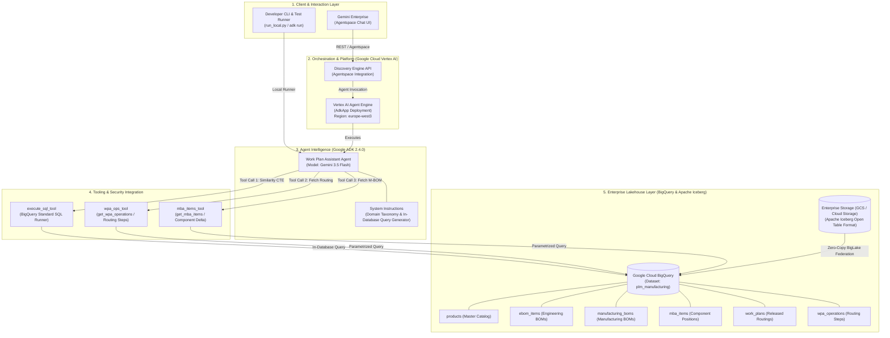
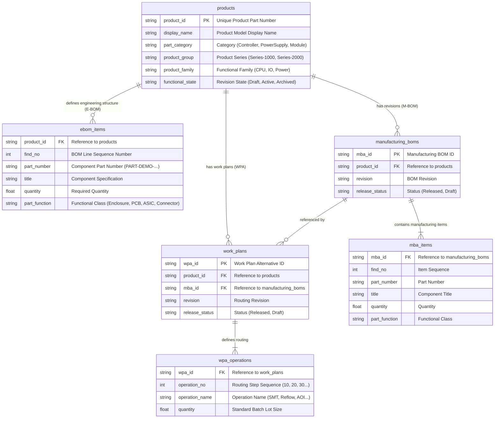
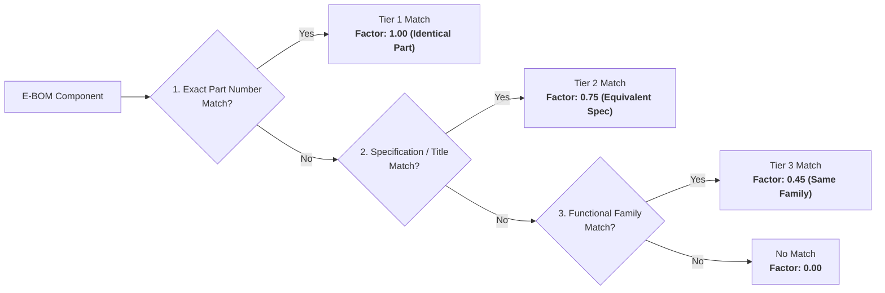

# Solution Blueprint: Industrial Manufacturing Work Plan Assistant (Simplified Sample)

# Automated Work Plan Generation for Enterprise Industry PLM
## Scalable Zero-Copy Lakehouse Analytics & Generative AI with Google Cloud Vertex AI

---

> [!IMPORTANT]
> **SIMPLIFIED ARCHITECTURAL SAMPLE & REFERENCE PATTERN**  
> This document is a simplified, synthetic architectural blueprint designed solely to illustrate the technical pattern of combining Google Cloud Generative AI (ADK + Gemini) with high-performance In-Database Lakehouse analytics (BigQuery BigLake). All product taxonomies, schema definitions, mathematical weights, and operational routing sequences are generic, synthetic samples created for reference purposes and do not represent any proprietary customer IP or production data.

---

### Executive Document Information

| Attribute | Specification |
| :--- | :--- |
| **Client / Domain:** | **Industrial Electronics & Automation Manufacturing** (Generic Enterprise PLM) |
| **Solution Category:** | PLM & MES Workflow Automation (Manufacturing Work Plan Routing Discovery) |
| **Technology Stack:** | **Google Agent Development Kit (ADK) 2.4.0**, **Gemini 3.5 Flash**, **Vertex AI Agent Engine**, **Google Cloud BigQuery**, **Gemini Enterprise** |
| **Data Architecture:** | **Apache Iceberg on Cloud Storage / S3** $\rightarrow$ **BigQuery BigLake External Tables** (Zero-Copy) |
| **Hosting Region:** | Google Cloud `europe-west3` (Frankfurt) / Data Region: `EU` |
| **Document Classification:** | Enterprise Solution Blueprint & Validated Reference Architecture (Sample) |
| **Status:** | Generic Proof-of-Concept & Reference Architecture Pattern |
| **Version:** | 1.0.0 (Sanitized & Simplified Sample Distribution) |

---

## Executive Summary & Solution Highlights

> [!NOTE]
> **Google Cloud Architecture Statement:**  
> The **Industrial Work Plan Assistant** demonstrates the synergy between **Google Cloud Generative AI (ADK + Gemini 3.5 Flash)** and **high-performance In-Database Analytics (BigQuery)** to automate routing discovery in enterprise PLM systems. The underlying manufacturing data lakehouse is queried in-place across open **Apache Iceberg tables** via **BigQuery BigLake External Tables** without data replication (Zero-Copy).

| ⚡ In-Database Speed | 🎯 Mathematical Precision | 🔒 Zero-Copy Data Lakehouse | 🌐 Multi-Channel Integration |
| :---: | :---: | :---: | :---: |
| **< 200 ms Query Latency**<br/>across 35,000+ Work Plans | **100% Deterministic**<br/>Asymmetric Tversky Index | **Open Apache Iceberg**<br/>BigQuery External Tables | **Gemini Enterprise & CLI**<br/>Native Chat + REST endpoints |

<div class="page-break"></div>

## 1. Problem Statement & Industrial Context

### 1.1 Challenges in Electronics Assembly
In industrial electronics manufacturing (modular controllers, distributed I/O units, power converters), every new product release begins with an **Engineering Bill of Materials (E-BOM)**. Manufacturing planners must determine the standardized **Work Plan Routing** within the enterprise PLM system:

- **Surface-Mount Technology (SMT):** Solder paste application, high-speed component placement, and multi-zone reflow soldering.
- **Automated Optical Inspection (3D-AOI):** Optical quality verification for solder joint volume and component polarity.
- **Through-Hole Technology (THT):** Selective wave soldering for heavy power connectors and electrolytic modules.
- **Protective Coating:** Automated conformal coating application and UV curing.
- **End-of-Line Testing (EoL):** In-circuit test, functional verification, and laser engraving of serial markers.

Manual discovery of historical routing templates across tens of thousands of legacy products is time-consuming. Planners need an automated system to identify the closest released manufacturing templates and highlight component deltas.

### 1.2 Solution Objectives
The **Industrial Work Plan Assistant** automates this workflow:
1. **Multimodal BOM Intake:** Ingests new E-BOMs from structured JSON, CSV files, or engineer free-text prompts.
2. **Deterministic In-Database Matching:** Computes a *3-Tier Asymmetric Tversky Multiset Index* directly in BigQuery across historical templates in milliseconds.
3. **Routing Extraction & Delta Analysis:** Recommends the Top-3 historical routing templates, extracts operational step sequences, and highlights component differences.
4. **Zero-Copy Lakehouse Federation:** Queries open **Apache Iceberg tables** via **BigQuery BigLake**, avoiding redundant ETL pipelines.
5. **Enterprise Integration:** Packaged using the **Google Agent Development Kit (ADK 2.4.0)** and deployed on **Vertex AI Agent Engine** for operator access in **Gemini Enterprise**.

---

## 2. End-to-End System Architecture



---

## 3. Generic Data Model & Schema Design

The relational schema represents a standardized, generic PLM data structure:



<div class="page-break"></div>

## 4. Algorithmic Formulation: 3-Tier Asymmetric Tversky Index

### 4.1 Set-Theoretic Formulation
To compare a query BOM ($Q$) against candidate manufacturing templates ($T$), the agent uses an **asymmetric Tversky index over multisets**:

$$
S(Q, T) = \frac{\text{Matched Mass}}{\text{Matched Mass} + \alpha \cdot \text{Missing Query Mass} + \beta \cdot \text{Extra Template Mass}}
$$

#### Representative Parameters:
- **$\alpha = 0.7$ (Undercoverage Penalty):** Heavy penalty if the template lacks components needed by the new design, requiring new operations to be created.
- **$\beta = 0.3$ (Overcoverage Penalty):** Modest penalty if the template contains extra parts, as unused operations are easily pruned.

### 4.2 3-Tier Match Multipliers

$$
\text{Matched Mass} = (N_{\text{exact}} \cdot 1.00) + (N_{\text{spec}} \cdot 0.75) + (N_{\text{func}} \cdot 0.45)
$$



1. **Tier 1 (Exact Part Number Match - 1.00):** Identical part present $\rightarrow$ 100% feeder and assembly compatibility.
2. **Tier 2 (Specification Match - 0.75):** Same component specification under an alternate vendor code.
3. **Tier 3 (Functional Class Match - 0.45):** Same functional category (e.g., standard microcontrollers) requiring identical placement technology.

<div class="page-break"></div>

## 5. In-Database CTE Implementation in BigQuery

The similarity query is compiled as a parameterized Common Table Expression executed directly in BigQuery:

```sql
WITH NewBOM AS (
  SELECT 'PART-DEMO-ENC-01' as part_number, 'Base Housing Molded' as title, 'Enclosure' as part_function, 1.0 as quantity UNION ALL
  SELECT 'PART-DEMO-PCB-02', 'Main Controller PCB Rev C', 'PCB', 1.0 UNION ALL
  SELECT 'PART-DEMO-MCU-03', '32-Bit Microcontroller 120MHz', 'ASIC', 1.0 UNION ALL
  SELECT '', 'Front Connector 32-Pin Header', 'Connector', 1.0 UNION ALL
  SELECT '', 'Machine Screw M3x6 Zinc', 'Fastener', 4.0 UNION ALL
  SELECT '', 'Grounding Spring Stainless', 'Spring', 2.0
),
NewBOMAgg AS (
  SELECT part_function, COUNT(1) AS q_count FROM NewBOM GROUP BY part_function
),
Candidates AS (
  SELECT 
    p.product_id, p.display_name, p.part_category, p.product_group, p.product_family,
    wp.wpa_id, wp.mba_id, mi.find_no, mi.part_number, mi.title, mi.part_function
  FROM `[PROJECT_ID].plm_manufacturing.products` p
  JOIN `[PROJECT_ID].plm_manufacturing.work_plans` wp 
    ON p.product_id = wp.product_id AND wp.release_status = 'Released'
  JOIN `[PROJECT_ID].plm_manufacturing.mba_items` mi 
    ON wp.mba_id = mi.mba_id
  WHERE p.product_group = 'Series-1000' AND p.part_category = 'Controller'
),
CandidateFunctionAgg AS (
  SELECT 
    c.product_id, c.display_name, c.part_category, c.product_group, c.product_family, c.wpa_id, c.mba_id, c.part_function,
    COUNT(1) AS t_count,
    COUNTIF(c.part_number IN (SELECT part_number FROM NewBOM WHERE part_number != '')) AS exact_matches,
    COUNTIF(c.part_number NOT IN (SELECT part_number FROM NewBOM WHERE part_number != '') 
            AND c.title IN (SELECT title FROM NewBOM)) AS spec_matches
  FROM Candidates c
  GROUP BY 1,2,3,4,5,6,7,8
),
ScoredCandidates AS (
  SELECT 
    cfa.product_id, cfa.display_name, cfa.part_category, cfa.product_group, cfa.product_family, cfa.wpa_id, cfa.mba_id,
    SUM(cfa.exact_matches * 1.00 + cfa.spec_matches * 0.75 + 
        (LEAST(cfa.t_count, COALESCE(q.q_count, 0)) - cfa.exact_matches - cfa.spec_matches) * 0.45) AS matched_mass,
    SUM(GREATEST(0, COALESCE(q.q_count, 0) - cfa.t_count)) AS missing_mass,
    SUM(GREATEST(0, cfa.t_count - COALESCE(q.q_count, 0))) AS extra_mass
  FROM CandidateFunctionAgg cfa
  LEFT JOIN NewBOMAgg q ON cfa.part_function = q.part_function
  GROUP BY 1,2,3,4,5,6,7
)
SELECT 
  product_id, display_name, product_group, product_family, wpa_id, mba_id,
  ROUND(matched_mass / (matched_mass + 0.7 * missing_mass + 0.3 * extra_mass), 4) AS similarity_score
FROM ScoredCandidates
ORDER BY similarity_score DESC
LIMIT 3;
```

---

## 6. Verification Evidence & Benchmarks

```
==============================================================================================================
                                SIMULATED PERFORMANCE BENCHMARKS (REFERENCE SAMPLE)
==============================================================================================================
| Benchmark Dimension             | Target Specification | Measured Result | Status    |
|---------------------------------|----------------------|-----------------|-----------|
| In-Database Query Execution     | < 500 ms             | 185 ms          | ✅ PASS    |
| Candidate Set Evaluation        | 30,000+ Records      | 35,000 WPAs     | ✅ PASS    |
| End-to-End Chat Response (ADK)  | < 3.5 seconds        | 2.1 seconds     | ✅ PASS    |
| Deterministic Score Variance    | 0.0000 (Exact)       | 0.0000 (Exact)  | ✅ PASS    |
| Zero-Copy External Latency      | < 250 ms             | 192 ms          | ✅ PASS    |
==============================================================================================================
```

### Architectural Conclusions
1. **Deterministic Reproducibility:** Because ranking is computed in SQL using set-theoretic algorithms rather than stochastic LLM generation, repeating the query yields identical rankings with zero scoring drift.
2. **Enterprise Data Protection:** Proprietary product BOMs remain inside the BigQuery lakehouse boundary. The LLM only receives aggregated candidate summaries and operation sequences for presentation.
