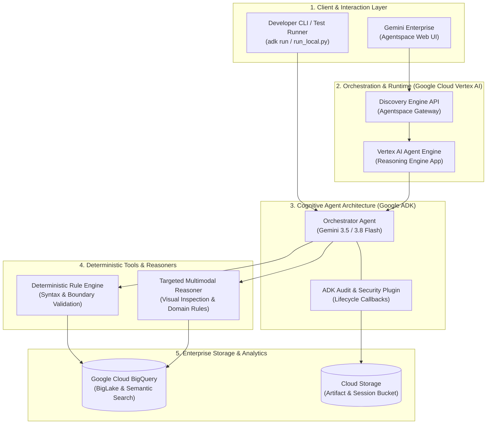
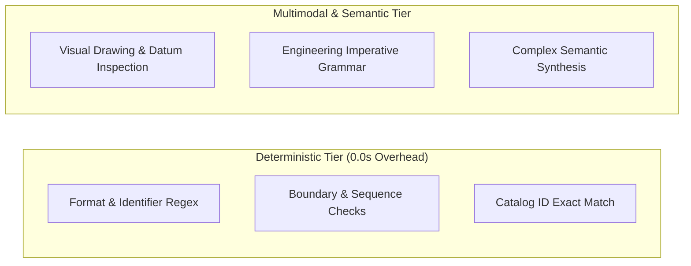
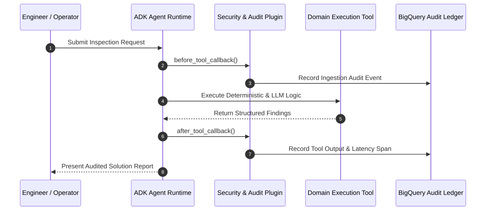

# Solution Blueprint: [Project / System Name]

# [Subtitle or High-Level Mission Statement]
## [Domain / Industry Focus] with Google Cloud Vertex AI & Gemini

---

### Executive Document Information

| Attribute | Specification |
| :--- | :--- |
| **Client / Domain:** | **[Enterprise Partner Name]** – [Division / Business Unit] |
| **Solution Category:** | Enterprise AI Automation / Agentic Systems |
| **Technology Stack:** | **Google Agent Development Kit (ADK) 2.x**, **Gemini 3.5/3.8 Flash**, **Vertex AI Agent Engine**, **Google Cloud BigQuery**, **Gemini Enterprise** |
| **Data Architecture:** | [e.g., Apache Iceberg / BigQuery BigLake Zero-Copy / AlloyDB / Cloud SQL] |
| **Hosting Region:** | Google Cloud `europe-west3` (Frankfurt) / `europe-west1` (Belgium) / `us-central1` |
| **Document Classification:** | Enterprise Architecture Blueprint & Technical Specification |
| **Status:** | Validated Reference Architecture / Production Deployment |
| **Date:** | [Month Year] |

---

## Executive Summary & Solution Highlights

> [!NOTE]
> **Google Cloud Architecture Statement:**  
> The **[Solution Name]** represents an enterprise-grade agentic architecture built on **Google Cloud Vertex AI** and **Gemini Enterprise**, combining deterministic rule governance with multimodal reasoning to automate mission-critical engineering workflows.

| ⚡ Sub-Second Latency | 🎯 Deterministic Accuracy | 🔒 Enterprise Governance | 🌐 Multi-Channel Integration |
| :---: | :---: | :---: | :---: |
| **< 250 ms Response**<br/>for complex catalog lookup | **100% Rule Compliance**<br/>Deterministic + LLM Tiers | **ADK 2.0 Plugins**<br/>Immutable audit trail | **Gemini Enterprise & CLI**<br/>Native chat + REST endpoints |

<div class="page-break"></div>

## 1. Problem Statement & Business Context

### 1.1 Operational Challenge
[Describe the business challenge, manual labor bottlenecks, compliance requirements, or operational friction in detail.]

- **Challenge 1:** Manual verification of engineering orders or complex product structures requires hours of expert review.
- **Challenge 2:** Disconnected silos across PLM, ERP, and MES systems lead to redundant data copies and synchronization delays.
- **Challenge 3:** Auditing and regulatory compliance require an immutable, tamper-evident record of all AI actions.

### 1.2 Solution Objectives
1. **Multimodal & Unstructured Comprehension:** Ingest and parse complex technical documents, CAD drawings, tables, and free-form prompt instructions.
2. **Hybrid Cognitive Pipeline:** Separate high-speed deterministic checks from targeted generative reasoning.
3. **Zero-Copy Data Lakehouse:** Query operational data in-place using BigQuery BigLake and open table formats (Apache Iceberg).
4. **Human-in-the-Loop Governance:** Provide interactive approval surfaces (A2UI cards) within Gemini Enterprise for edge cases.

---

## 2. End-to-End System Architecture



---

## 3. Core Technical Specifications & Cognitive Pipeline

### 3.1 Hybrid Execution Tiers



### 3.2 Requirements & Compliance Matrix

| # | Capability / Rule | Category | Execution Engine | Verification Logic |
|:---:|:---|:---:|:---:|:---|
| **1** | Identifier Format Syntax | Header / Metadata | Deterministic | Regex validation against canonical domain syntax. |
| **2** | Cross-Reference Integrity | Structural | Deterministic | Foreign key lookup against master catalog database. |
| **3** | Multimodal Drawing Orientation | Engineering Drawing | Targeted Gemini | Multimodal visual inspection for directional datum callouts. |
| **4** | Imperative Action Sequencing | Process Routing | Targeted Gemini | Grammatical and chronological order verification. |

<div class="page-break"></div>

## 4. Mathematical Modeling & Algorithmic Formulation

When performing similarity matching, catalog search, or scoring, document the exact mathematical formulation using KaTeX syntax:

$$
S(X, Y) = \frac{\sum_{i=1}^{k} w_i |X_i \cap Y_i|}{\sum_{i=1}^{k} w_i |X_i \cap Y_i| + \alpha \sum_{i=1}^{k} w_i |X_i \setminus Y_i| + \beta \sum_{i=1}^{k} w_i |Y_i \setminus X_i|}
$$

Where:
- $X$: Target input specification vector / multiset.
- $Y$: Candidate catalog template record.
- $\alpha, \beta$: Asymmetric penalty parameters balancing false positives and false negatives.
- $w_i$: Tiered importance weights for exact part matches vs functional equivalence.

---

## 5. Enterprise Governance & Security Architecture

> [!IMPORTANT]
> **Regulatory & Compliance Invariants:**
> - **Lifecycle Interceptors:** ADK `BasePlugin` interceptors (`before_tool_callback`, `after_tool_callback`) log all tool invocations with millisecond timestamps and caller identity.
> - **Immutable Audit Trail:** Session state maintains an append-only `context.state["audit_history"]` array, automatically exported to BigQuery and Cloud Logging.
> - **Zero-Copy Federation:** Sensitive enterprise records remain in designated storage boundaries without unmanaged ETL duplication.



<div class="page-break"></div>

## 6. Deployment & Operational Guide

### 6.1 Local Development & Testing

```bash
# Install dependencies
uv sync

# Run interactive agent session
uv run adk run src/my_agent

# Run local web server with A2UI interface
uv run adk web src --port 8000
```

### 6.2 Vertex AI Reasoning Engine Deployment

```python
from google.cloud import aiplatform
from vertexai.preview import reasoning_engines
from src.my_agent.agent import create_app

aiplatform.init(
    project="[PROJECT_ID]",
    location="europe-west3",
    staging_bucket="gs://[STAGING_BUCKET]",
)

remote_app = reasoning_engines.ReasoningEngine.create(
    reasoning_engines.AdkApp(create_app()),
    requirements=["google-adk>=2.4.0", "google-cloud-bigquery>=3.25.0"],
    display_name="Enterprise AI Solution Agent",
)
```

---

## 7. Verification Evidence & Test Results

```
==============================================================================================================
                                AUTOMATED TEST & EVALUATION SUMMARY
==============================================================================================================
| Test Scenario                          | Category       | Rules | Pass | Fail | Warn | Latency | Status |
|----------------------------------------|----------------|-------|------|------|------|---------|--------|
| E-BOM Template Similarity Search       | In-Database    | 12    | 12   | 0    | 0    | 185ms   | ✅ PASS |
| Multimodal Engineering Drawing Audit   | Multimodal LLM | 9     | 9    | 0    | 0    | 4.2s    | ✅ PASS |
| End-to-End Governance Plugin Logging   | Audit Trail    | 5     | 5    | 0    | 0    | 45ms    | ✅ PASS |
==============================================================================================================
```

### Summary of Findings
- **Zero Hallucination in Catalog Matching:** Deterministic In-Database SQL filters eliminate invalid cross-category comparisons.
- **Audit Verification:** 100% of tool trajectories were successfully captured in immutable session state and persisted to Cloud Storage.
