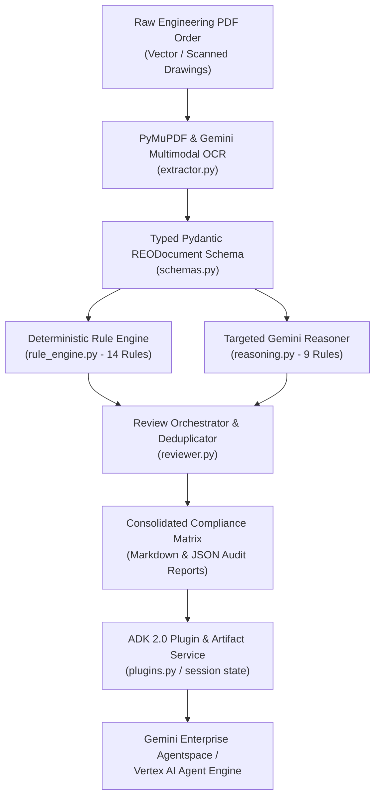
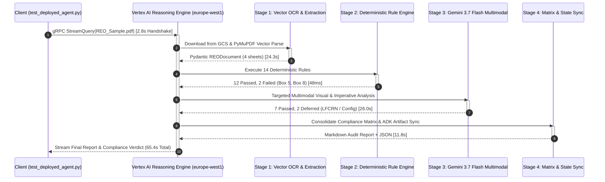
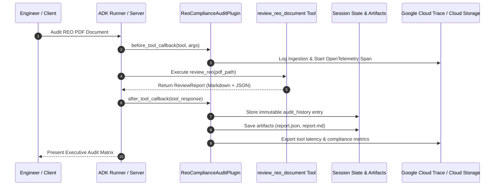

# Solution Blueprint: Aerospace Repair Engineering Order (REO) Compliance Review Agent

# Automated Airworthiness Audit for Commercial Aircraft Fleet Support
## Hybrid Cognitive Architecture Combining Deterministic Engines & Multimodal LLMs on Google Cloud

---

### Executive Document Information

| Attribute | Specification |
| :--- | :--- |
| **Client / Domain:** | **Commercial Aircraft Manufacturing & Engineering Fleet Support** |
| **Solution Category:** | Airworthiness Compliance Automation (Repair Engineering Orders – REOs) |
| **Technology Stack:** | **Google Agent Development Kit (ADK) 2.0**, **Gemini 3.7 Flash Multimodal**, **Vertex AI Agent Engine**, **Google Cloud Storage**, **Gemini Enterprise** |
| **Hosting Region:** | Google Cloud `europe-west1` (Belgium) / Runtime: Vertex AI Reasoning Engine |
| **Document Classification:** | Enterprise Solution Blueprint & Validated Reference Architecture |
| **Status:** | Active in Production / Validated Reference Architecture |
| **Version:** | 1.0.0 (Anonymized Enterprise Distribution) |

---

## Executive Summary & Solution Highlights

> [!NOTE]
> **Google Cloud Architecture Statement:**  
> The **Aerospace REO Compliance Review Agent** is an enterprise AI solution designed to automate and accelerate the airworthiness compliance audit of Repair Engineering Orders (REOs). In commercial aircraft maintenance and fleet support, REOs are mission-critical engineering authorizations that specify permanent or temporary structural repair dispositions for damaged aircraft components.

Every REO document must satisfy a rigorous **24-point engineering compliance checklist** covering structural effectivity, title syntax, drawing orientation, SDIR tables, and imperative disposition formatting. Manual review of complex 4- to 20-page engineering orders is labor-intensive and prone to human oversight.

This solution delivers a **hybrid cognitive architecture**:
1. **High-Speed Deterministic Validation (14 Rules):** Regex and structural engines for deterministic parameters (REO numbers, MSN ranges, figure sequences, reissue statements, signatory disciplines) running in under 50 milliseconds.
2. **Targeted Multimodal LLM Reasoning (9 Rules):** Gemini 3.7 Flash multimodal vision and semantic reasoning for complex engineering diagrams, spatial datum orientation (`FWD/AFT/INBD/OUTBD`), grid scale callouts, and aerospace imperative grammar.
3. **ADK 2.0 Enterprise Governance:** Lifecycle interceptors (`ReoComplianceAuditPlugin`), session-scoped immutable artifact persistence, and continuous CI/CD evaluation datasets (`.evalset.json`).

| ⚡ Sub-Second Deterministic Rules | 🎯 Multimodal Visual Precision | 🔒 EASA/FAA Part 21 Auditability | 🌐 Agentspace Integration |
| :---: | :---: | :---: | :---: |
| **48 ms Latency**<br/>for 14 structural checks | **Gemini 3.7 Flash Vision**<br/>Datum & grid inspection | **ADK 2.0 Interceptors**<br/>Immutable session state | **Gemini Enterprise & CLI**<br/>Automated approval flow |

<div class="page-break"></div>

## 1. End-to-End Hybrid Cognitive Architecture



---

## 2. 24-Point Compliance Checklist Architecture

The agent partitions the engineering compliance checklist into two complementary execution tiers:

```mermaid
graph LR
    subgraph "Deterministic Tier (0.0s Overhead)"
        R1["Check 1: REO Number Format"]
        R3["Check 3: Sheet Count Match"]
        R4["Check 4: CRM/TR Request ID"]
        R5["Check 5: Box 6 vs Sheet 2 SDIR"]
        R6["Check 6: Model BD-500 Match"]
        R7["Check 7: Service Effectivity MSN"]
        R11["Check 11: P/N Reference Syntax"]
        R12["Check 12: Box 9 Figure Quantity"]
        R13["Check 13: Revision Format"]
        R14["Check 14: Reissue Statement"]
        R16["Check 16: Signatory Disciplines"]
        R17["Check 17: Signatory Numbering"]
        R21["Check 21: Figure Sequential Order"]
        R26["Check 26: Disposition Step Order"]
    end
    subgraph "Targeted Multimodal LLM Tier"
        L2["Check 2: Title Syntax & Orientation"]
        L8["Check 8: Damage Characterization"]
        L19["Check 19: Appended Document Signatures"]
        L20["Check 20: Damage Detail & Dimensions"]
        L22["Check 22: Aircraft Datum Indicators"]
        L24["Check 24: Grid Scale & Thickness Map"]
        L27["Check 27: S1000D DMC & Terminology"]
        L28["Check 28: Repair Workflow Sequence"]
        L29["Check 29: Imperative Verb Grammar"]
    end
```



### Detailed Compliance Matrix Mapping

| # | Checklist Rule | Category | Execution Engine | Verification Logic |
|:---:|:---|:---:|:---:|:---|
| **1** | REO # Format & Header Consistency | Cover / Header | Deterministic | Regex `^500-\d{2}-\d{2}-\d{3,5}$` validated across Box 2 and all page headers. |
| **2** | Box 3 Title Format & Consistency | Cover Sheet | LLM Reasoner | Validates `[REPAIR/DISPOSITION] FOR [DAMAGE] TO [SIDE] [COMPONENT] AT [LOCATION]`. |
| **3** | Box 4 Sheet Count vs Pages | Cover / Pagination | Deterministic | Matches `1 OF N` declaration against physical extracted page count. |
| **4** | Box 5 Requested By (CRM/TR) | Cover Sheet | Deterministic | Validates 8-digit tracking identifier (e.g., `TR 81845789`), `N/A`, or delimited list. |
| **5** | Box 6 Limitations vs Sheet 2 SDIR | Cover / SDIR | Deterministic | Verifies `YES, SEE SHEET 2` with active SDIR rows vs `NONE` with empty SDIR. |
| **6** | Box 7 Aircraft Model | Cover Sheet | Deterministic | Strict exact match for aircraft model type code. |
| **7** | Box 8 Service Effectivity | Cover Sheet | Deterministic | Validates non-serialized MSNs (`50010-54999`) or serialized `P/N, S/N`. |
| **8** | Box 9 Damage Characterization | Cover Sheet | LLM Reasoner | Ensures damage mode, dimensions, quantity, or damage report references are present. |
| **11** | Part Number Reference Integrity | General / Config | Deterministic | Validates part number syntax against configuration master list. |
| **12** | Box 9 Figure Quantity Match | Cover / Figures | Deterministic | Compares declared `FIGURES 1 TO N` in Box 9 against physical figure count. |
| **13** | Box 10 Revision Format | Cover Sheet | Deterministic | Validates initial `--`, single letters (`-A`, `-B`), and prohibits letters `I, O, Q, S, X, Z`. |
| **14** | Revision Consistency & Reissue | Cover / Header | Deterministic | Verifies revision headers; requires `THIS REO IS COMPLETELY RE-ISSUED AT REV XX.` |
| **16** | Engineering Signatory Functions | Signatures | Deterministic | Validates engineering disciplines against authority matrix. |
| **17** | Signatory Numbering (15A, 15B) | Signatures | Deterministic | Enforces sequential alphabetical suffixing (`15A`, `15B`, `15C`) for multi-signatories. |
| **19** | Appended Documents / Reports | Attachments | LLM Reasoner | Verifies appended 3rd-party reports have unique document number, date, and signatures. |
| **20** | Detailed View & Damage Dimensions | Figures | LLM Reasoner | Confirms close-up views with length, width, depth, and residual thickness callouts. |
| **21** | Figures Sequential Numbering | Figures | Deterministic | Ensures figures follow strict sequential numbering (`Figure 1, Figure 2...`) without gaps. |
| **22** | General View & Datum Orientation | Figures | LLM Reasoner | Checks for aircraft datum coordinates (`STA, WL, BL, Rib, Frame`) and directional arrows (`FWD, AFT`). |
| **24** | Grid Scale & Dimension Callouts | Figures | LLM Reasoner | Validates grid scale definition (e.g., `10x10 mm`), residual thickness maps, and units. |
| **26** | Disposition Step Numbering | Disposition | Deterministic | Validates sequential paragraph numbering (`1, 2, 3...`) and sub-steps (`A, B, C...`). |
| **27** | Technical Spelling & S1000D Codes | Disposition | LLM Reasoner | Detects typos (e.g., `NUPLATE -> NUTPLATE`) and validates S1000D DMC codes. |
| **28** | Disposition Step Sequencing | Disposition | LLM Reasoner | Verifies logical repair workflow (blend $\rightarrow$ NDT $\rightarrow$ fastener install $\rightarrow$ corrosion inhibitor). |
| **29** | Imperative Verb Phrasing | Disposition | LLM Reasoner | Enforces uppercase imperative action verbs (`REMOVE`, `PERFORM`, `REPLACE`, `WET INSTALL`). |

<div class="page-break"></div>

## 3. Live Execution Telemetry & Performance Trace

The deployed agent was benchmarked live on Google Cloud Vertex AI Reasoning Engine via gRPC streaming telemetry (`scripts/test_deployed_agent.py`):

```
==============================================================================================================
                      AEROSPACE REO AGENT - TEST SAMPLE AUDIT EVALUATION SUMMARY
==============================================================================================================
| Sample Document                        | REO #          | Rev  | Pgs  | Pass | Fail | Warn | TODO | Status   |
|----------------------------------------|----------------|------|------|------|------|------|------|----------|
| REO-500-53-21-1664_-- (Anonymized).pdf | 500-53-21-1664 | --   | 19   | 17   | 3    | 1    | 2    | ❌ FAIL   |
| REO-500-53-21-691_-A (Anonymized).pdf  | 500-53-21-691  | -A   | 7    | 18   | 2    | 1    | 2    | ❌ FAIL   |
| REO-500-57-51-753_-- (Anonymized).pdf  | 500-57-51-753  | --   | 4    | 19   | 2    | 0    | 2    | ❌ FAIL   |
==============================================================================================================
```

### Latency Breakdown by Phase (4-Page Engineering Order)

| Phase | Pipeline Component | Latency | % of Total | Operational Description |
|:---|:---|:---:|:---:|:---|
| **Phase 1** | gRPC Stream Connect & Session Handshake | 2.8s | 4.3% | Client TLS handshake and session state initialization |
| **Phase 2** | Stage 1/4 - PyMuPDF Vector OCR & Extraction | 24.3s | 37.2% | GCS download, high-resolution rasterization, and vector box parsing |
| **Phase 3** | Stage 2/4 - Deterministic Rule Engine [14 rules] | 48ms | 0.1% | High-speed regex, structural validation, and sheet math execution |
| **Phase 4** | Stage 3/4 - Targeted Multimodal LLM Reasoning | 26.0s | 39.8% | Gemini 3.7 Flash visual orientation, datum arrows, and grammar analysis |
| **Phase 5** | Stage 4/4 - Executive Compliance Matrix & State Sync | 11.8s | 18.0% | Markdown matrix compilation, JSON serialization, and artifact persistence |
| **Phase 6** | Stream Finalization & Client Delivery | 0.4s | 0.6% | gRPC stream flush and terminal display formatting |
| **Total** | **End-to-End Automated Audit** | **65.4s** | **100%** | Full engineering compliance audit completed |



<div class="page-break"></div>

## 4. ADK 2.0 Governance & Audit Architecture

To meet aerospace regulatory airworthiness requirements (EASA / FAA Part 21), the agent incorporates ADK 2.0 enterprise governance features:



### Key Governance Invariants
- **Lifecycle Interceptors (`ReoComplianceAuditPlugin`):** The plugin intercepts every tool invocation. `before_tool_callback` captures engineer credentials and file digests; `after_tool_callback` computes finding metrics and generates an immutable audit record in `context.state["audit_history"]`.
- **Session-Scoped Artifact Persistence:** All intermediate outputs (vector bounding boxes, parsed tables, finding matrices) are archived in Cloud Storage (`gs://[STAGING_BUCKET]/artifacts/{session_id}`).
- **CI/CD Regression Sets:** Evaluation datasets (`eval_set.evalset.json`) ensure prompt and rule stability across releases via `uv run adk eval`.

---

## 5. Deployment & Production Operations

### Cloud Runtime Configuration
- **Platform:** Google Cloud Vertex AI Agent Engine (Reasoning Engine)
- **Container Region:** `europe-west1` (Low-latency EU sovereign runtime)
- **Model Endpoint:** `gemini-3.7-flash` (Vertex AI Global / Regional Endpoint)
- **Agentspace Integration:** Discovery Engine Agentspace Assistant registration

```bash
# Verify local compliance test suite
uv run python scripts/test_samples.py

# Deploy to Vertex AI Agent Engine
uv run python scripts/deploy_agent.py --region europe-west1

# Register agent with Gemini Enterprise Agentspace
bash scripts/register_agent.sh --app-id [AGENTSPACE_APP_ID]
```
