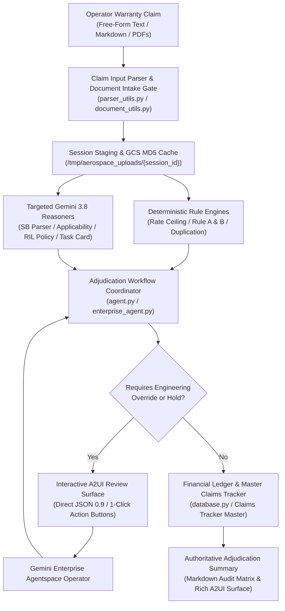
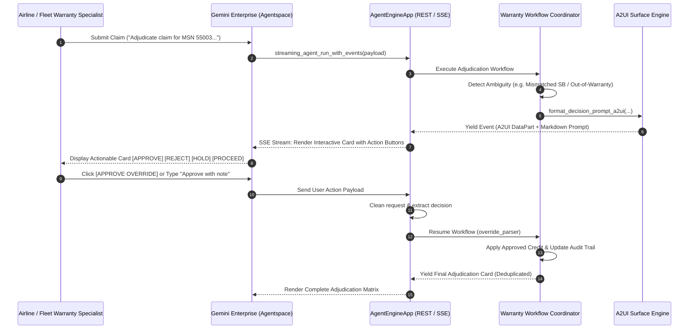

# Solution Blueprint: Aerospace Service Bulletin (SB) Warranty Claim Adjudication Agent

# Automated Warranty Claim Adjudication for Commercial Aircraft Fleets
## Multi-Agent Cognitive Architecture with Human-in-the-Loop A2UI Surfaces on Google Cloud

---

### Executive Document Information

| Attribute | Specification |
| :--- | :--- |
| **Client / Domain:** | **Commercial Aircraft Manufacturing & Fleet Support** |
| **Solution Category:** | Warranty Claim Adjudication & Financial Reconciliation Automation |
| **Technology Stack:** | **Google Agent Development Kit (ADK) 2.0**, **Gemini 3.8 Flash**, **Vertex AI Agent Engine**, **A2UI Protocol v0.9**, **Gemini Enterprise** |
| **Data Architecture:** | **Cloud SQL PostgreSQL Ledger** + **Cloud Storage MD5 Cache** + **Master Claims Tracker** |
| **Hosting Region:** | Google Cloud `europe-west1` (Belgium) / Runtime: Vertex AI Reasoning Engine |
| **Document Classification:** | Enterprise Solution Blueprint & Validated Reference Architecture |
| **Status:** | Active in Production / Validated Reference Architecture |
| **Version:** | 1.3.0 (Anonymized Enterprise Distribution) |

---

## Executive Summary & Solution Highlights

> [!NOTE]
> **Google Cloud Architecture Statement:**  
> The **Aerospace Service Bulletin (SB) Warranty Claim Adjudication Agent** is an enterprise AI solution engineered to automate, accelerate, and govern the warranty adjudication lifecycle for commercial aircraft fleets. When aircraft manufacturers issue Service Bulletins for structural, avionics, or systems modifications, airline operators perform technical retrofits and submit warranty reimbursement claims for documented maintenance labor and replacement parts.

Adjudicating warranty claims requires rigorous compliance verification across multiple independent dimensions:
1. **Airframe Applicability:** Confirming that claimant aircraft Manufacturer Serial Numbers (MSNs) are within the exact applicability ranges defined in the SB Planning Information.
2. **Contractual Warranty & Campaign Status:** Validating whether the airframe is under base manufacturer warranty or eligible for commercial industry support under a Monitored Retrofit Campaign / Retrofit Information Letter (RIL).
3. **Task Card Substantiation:** Cross-referencing physical maintenance task cards to confirm aircraft registration matches, embodiment dates, executed procedures, and recorded mechanic hours.
4. **Labor Rate & Hours Reconciliation:** Applying contractual labor rate ceilings and enforcing dual-epoch adjudication rules (Rule A vs. Rule B) and Vendor Service Bulletin (VSB) hour allowances.
5. **Anti-Duplication Protection:** Preventing duplicate reimbursements against historical ledgers in the Master Claims Tracker.
6. **Audited Human-in-the-Loop (HITL) Governance:** Empowering warranty engineers to review and override edge cases via interactive A2UI cards directly within Gemini Enterprise.

Manual adjudication takes 45–90 minutes per claim dossier and is vulnerable to human error. This solution automates the workflow end-to-end in **under 15 seconds**, delivering deterministic financial accuracy, auditable reasoning, and seamless operator interaction.

| ⚡ 15-Second Adjudication | 🎯 Deterministic Hours Reconciliation | 🔒 Anti-Duplication Protection | 🌐 Interactive A2UI Surfaces |
| :---: | :---: | :---: | :---: |
| **From 60 min to <15s**<br/>per claim dossier | **Dual-Epoch Rule Engine**<br/>Rule A vs Rule B hours | **Historical Ledger Audit**<br/>Zero duplicate payouts | **Gemini Enterprise & A2UI**<br/>1-Click Action Buttons |

<div class="page-break"></div>

## 1. Multi-Agent Cognitive Architecture



---

## 2. Specialized Subagent Specifications

The agent operates as a synchronized hierarchy of specialized agents, deterministic rule engines, and interactive interface controllers built on the **Google Agent Development Kit (ADK 2.0)**:

| Agent / Component | Execution Engine | Primary Responsibility | Validation / Decision Rule |
|:---|:---:|:---|:---|
| **`warranty_coordinator`** | ADK Workflow | Session isolation, run-sequence tracking, and final A2UI stream packaging. | Enforces session context, deduplicates completion cards, and guarantees non-blocking SSE streaming. |
| **`claim_input_parser`** | Gemini 3.8 Flash | Parses unstructured emails, free-form text, and multi-column markdown tables into typed claims. | Classifies single-MSN, multi-MSN batch, single subclaim, and multi-subclaim part remedies. |
| **`document_intake_gate`** | Deterministic / PyMuPDF | Ingests PDF attachments, inspects inner content, and stages files per session. | Validates content-level SB number match; rejects mismatched SBs even if filename is renamed. |
| **`sb_parser`** | Gemini 3.8 Flash | Extracts release date, compliance category, MSN ranges, standard procedure hours, VSB hours, and RIL mandates. | Distinguishes procedure hours from setup/closeout; aggregates Vendor SB hours; flags monitored retrofit campaigns. |
| **`sb_applicability_checker`** | Gemini 3.8 Flash | Verifies claimant aircraft MSN against complex Planning Information effectivity ranges. | Evaluates numeric boundaries (`55018 thru 55289`); flags missing documents with explicit explanation. |
| **`task_card_validator`** | Gemini 3.8 Flash | Inspects completed maintenance task cards. | Matches tail registration, extracts embodiment date ($YYYY$-$MM$-$DD$), and sums executed mechanic hours. |
| **`campaign_policy_checker`** | Gemini 3.8 Flash | Evaluates RIL instructions, campaign expiration dates, and supplier commercial terms. | Detects third-party supplier mandates and directs claims with $0.00 credit and regulatory directives. |
| **`man_hour_calculator`** | Deterministic Engine | Reconciles documented actual hours against claimed and standard procedure hours. | Applies **Rule A** (post-Jan 2024: full actuals) or **Rule B** (pre-Jan 2024: standard procedure cap). |
| **`duplication_checker`** | Deterministic / SQL | Queries Master Claims Tracker for previous payouts. | Matches MSN + SB Number + Subclaim Part; flags existing credits to prevent double reimbursement. |
| **`override_parser`** | Hybrid (Regex + LLM) | Processes operator feedback during human-in-the-loop pauses. | Classifies 1-click A2UI action payloads and natural language responses into 4 `DecisionVariant`s. |

<div class="page-break"></div>

## 3. Mathematical Labor Reconciliation Engine

The agent enforces deterministic mathematical formulations to compute reimbursable hours and financial credits:

$$
\text{Reconciled Hours} = 
\begin{cases} 
\text{Actual Documented Hours}, & \text{if } \text{SB Release Date} \ge \text{2024-01-01} \quad (\textbf{Rule A}) \\
\min(\text{Actual Hours}, \text{Claimed Hours}, \text{Std Hours} + \text{VSB Hours}), & \text{if } \text{SB Release Date} < \text{2024-01-01} \quad (\textbf{Rule B})
\end{cases}
$$

$$
\text{Applied Labor Rate} = \min(\text{Claimed Rate}, \text{Contractual Negotiated Rate})
$$

$$
\text{Total Financial Credit (USD)} = \text{Reconciled Hours} \times \text{Applied Labor Rate}
$$

### Part Suffix Procedure Resolver
Service Bulletins list standard hours in lettered procedure sections (`Part A`, `Part B`, `Part C`, `Part D`), whereas operator warranty claims reference numeric dash suffixes (`-01`, `-02`, `-03`, `-04`, such as `SB-282006-03`). The agent implements a deterministic resolver:
- `-01` $\rightarrow$ Index 0 (`Part A`)
- `-02` $\rightarrow$ Index 1 (`Part B`)
- `-03` $\rightarrow$ Index 2 (`Part C`)
- `-04` $\rightarrow$ Index 3 (`Part D`)
- *Fallback:* If unresolved, falls back to $\max(\text{standard\_hours})$ to prevent false caps and erroneous human escalations.

---

## 4. Human-in-the-Loop (HITL) & A2UI Protocol

To ensure aerospace governance compliance, the agent incorporates an interactive Human-in-the-Loop decision architecture powered by **A2UI Basic Catalog v0.9**:



### The 4 A2UI Decision Variants
1. **`APPROVE` / `OVERRIDE`:** Overrides a policy failure, out-of-warranty condition, or task card discrepancy with documented engineering rationale.
2. **`PROCEED_STANDARD`:** Instructs the agent to continue with strict default policy boundaries without manual concessions.
3. **`REJECT`:** Confirms rejection of non-compliant claims, maintaining zero credit and updating the case registry.
4. **`HOLD` / `HOLD_FOR_UPLOAD`:** Pauses adjudication pending operator upload of missing required documentation (e.g., missing Task Card or RIL).

<div class="page-break"></div>

## 5. Deployment Specifications & Live Production Architecture

```
==============================================================================================================
                                LIVE RUNTIME DEPLOYMENT MATRIX
==============================================================================================================
| Configuration Parameter      | Production Deployment Value     | Operational Role                          |
|:-----------------------------|:--------------------------------|:------------------------------------------|
| **Google Cloud Project**     | `[PROJECT_ID]`                  | Sovereign host project for Vertex AI & GCS |
| **Vertex AI Runtime**        | Reasoning Engine (europe-west1) | Containerized agent execution environment  |
| **Primary LLM Model**        | `gemini-3.8-flash`              | Global multimodal & subagent reasoning     |
| **Gemini Enterprise App**    | Discovery Engine Agentspace     | Interactive operator web workspace        |
| **Database Ledger**          | Cloud SQL PostgreSQL / BigQuery | Master Claims audit & transaction history  |
| **Document Cache Bucket**    | `gs://[DATA_BUCKET]`            | MD5 content hashing & fast retrieval       |
==============================================================================================================
```

### Verification & Automated Regression Suite
- **Regression Evaluation Set:** Evaluated via `uv run adk eval` against 50+ golden claim dossiers.
- **Decision Advisory Framing:** All user-facing approval outcomes are presented as **"Suggested to Approve"** with itemized justifications, empowering human warranty engineers to retain statutory authority while benefiting from automated calculation.
