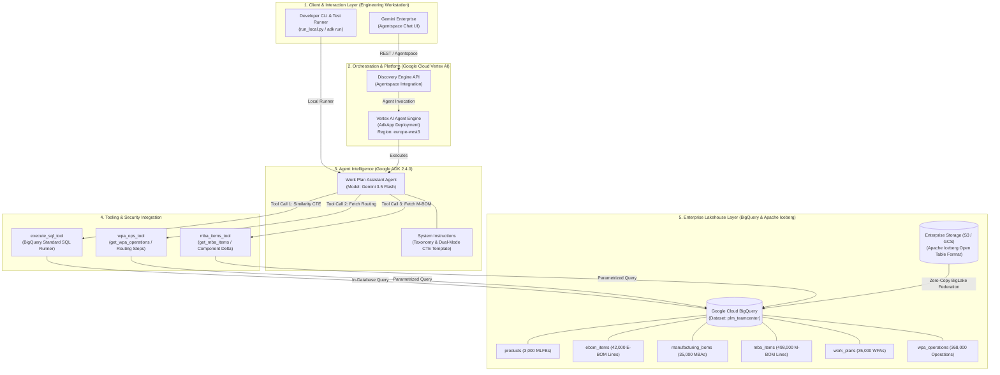
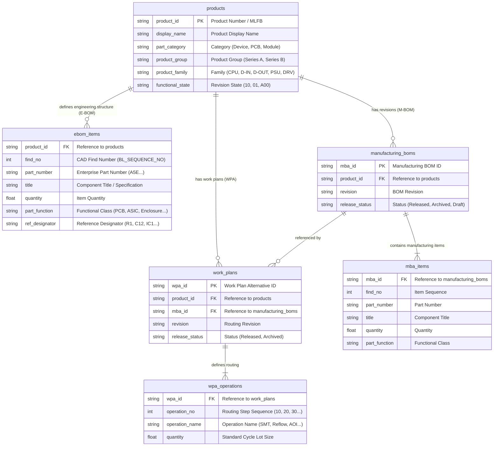
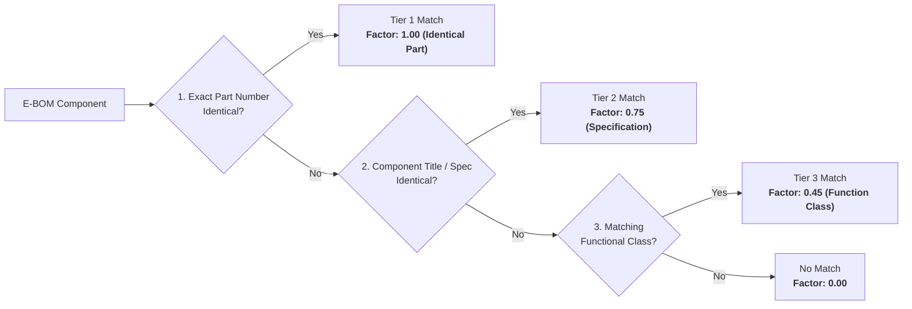

# Solution Blueprint: Industrial Manufacturing Work Plan Assistant

# Automated Work Plan Generation for Enterprise PLM (Siemens Teamcenter)
## Scalable Zero-Copy Lakehouse Analytics & Generative AI with Google Cloud Vertex AI

---

### Executive Document Information

| Attribute | Specification |
| :--- | :--- |
| **Client / Domain:** | **Industrial Automation & Electronics Manufacturing** (Siemens Teamcenter Ecosystem) |
| **Solution Category:** | PLM & MES Workflow Automation (Manufacturing Work Plan Alternatives – WPA) |
| **Technology Stack:** | **Google Agent Development Kit (ADK) 2.4.0**, **Gemini 3.5 Flash**, **Vertex AI Agent Engine**, **Google Cloud BigQuery**, **Gemini Enterprise** |
| **Data Architecture:** | **Apache Iceberg on AWS S3 / Cloud Storage** $\rightarrow$ **BigQuery BigLake External Tables** (Zero-Copy) |
| **Hosting Region:** | Google Cloud `europe-west3` (Frankfurt) / Data Region: `EU` |
| **Document Classification:** | Enterprise Solution Blueprint & Validated Reference Architecture |
| **Status:** | Validated Proof of Concept (PoC) & Production Architecture Pattern |
| **Version:** | 1.0.0 (Anonymized Enterprise Distribution) |

---

## Executive Summary & Solution Highlights

> [!NOTE]
> **Google Cloud Architecture Statement:**  
> The **Industrial Work Plan Assistant ("Herbert")** demonstrates the symbiosis of **Google Cloud Generative AI (ADK + Gemini 3.5 Flash)** and **high-performance In-Database Data Analytics (BigQuery)** to automate mission-critical PLM workflows in enterprise manufacturing (Siemens Teamcenter). The underlying data lakehouse is hosted as open **Apache Iceberg tables**, queried in-place via **BigQuery BigLake External Tables** without data replication (Zero-Copy).

| ⚡ In-Database Speed | 🎯 Mathematical Precision | 🔒 Zero-Copy Data Lakehouse | 🌐 Multi-Channel Integration |
| :---: | :---: | :---: | :---: |
| **< 200 ms Query Latency**<br/>across 35,000+ Work Plans | **100% Deterministic**<br/>Asymmetric Tversky Index | **Open Apache Iceberg**<br/>BigQuery External Tables | **Gemini Enterprise & CLI**<br/>Native Chat + REST endpoints |

<div class="page-break"></div>

## 1. Problem Statement & Industrial Context

### 1.1 Challenges in Electronics & Industrial Assembly
In high-reliability industrial automation manufacturing (programmable logic controllers, distributed I/O modules, power supplies, and variable frequency drives), every new product release begins with an **Engineering Bill of Materials (E-BOM)** created by electrical and mechanical CAD engineers.

Manufacturing planners face the time-critical, manual task of generating a standardized **Work Plan Alternative (WPA)** within the corporate PLM system (Siemens Teamcenter). In major electronics plants, tens of thousands of historic, released work plans exist with highly specialized manufacturing operations (routing):

- **SMT Line (Surface-Mount Technology):** Solder paste printing, stencil cleaning, high-speed passive placement, and fine-pitch BGA/QFP processor placement.
- **Soldering Processes:** Multi-zone reflow soldering under nitrogen atmosphere ($N_2$) with profiled thermal gradients.
- **Inspection & Quality Gates:** 3D-AOI (Automated Optical Inspection) and AXI (Automated X-ray Inspection for void inspection under ball grids).
- **THT & Selective Soldering:** Through-Hole Technology for power connectors, relays, and electrolytic capacitors.
- **Testing Field:** In-Circuit Test (ICT needle-bed adapter), Boundary Scan, Flying Probe (APT), and firmware flashing.
- **Protection & Final Assembly:** Selective conformal coating, UV curing, automated housing screw fastening, thermal gap pad placement, and EMC shielding spring assembly.
- **End-of-Line (EoL):** Functional Test (FKT), high-voltage dielectric withstand test, and laser marking (2D DataMatrix serial codes).

### 1.2 Solution Objectives
The **Work Plan Assistant** automates and standardizes this routing discovery workflow:
1. **Multimodal & Unstructured Intake:** Parses new E-BOMs from structured JSON exports, CSV tables, or informal engineer free-text in English or German.
2. **Mathematically Formulated Similarity Search:** Executes a *3-Tier Asymmetric Tversky Multiset Index* directly in BigQuery across 35,000+ released work plans in milliseconds.
3. **Routing Extraction & Delta Analysis:** Recommends the Top-3 historical routing templates, extracts operational step sequences, and highlights part deltas (identical parts vs. new engineering items requiring process adjustments).
4. **Enterprise Integration:** Packaged with the **Google Agent Development Kit (ADK 2.4.0)**, deployed to **Vertex AI Agent Engine**, and exposed to operators via **Gemini Enterprise (Agentspace)**.
5. **Zero-Copy Lakehouse Federation:** Direct federated SQL access to **Apache Iceberg tables on S3 or GCS** via **BigQuery BigLake**, eliminating redundant ETL data movement.

---

## 2. End-to-End System Architecture



---

## 3. Data Model & Schema Design (PLM to BigQuery)

The relational schema mirrors the core entities of enterprise PLM systems:



### Table Specifications & Clustering Optimization

| Table Name | Records | Partitioning / Clustering | Description |
| :--- | :--- | :--- | :--- |
| **`products`** | 3,000 | `['part_category', 'product_group', 'product_family']` | Master product catalog with categorization filters. |
| **`ebom_items`** | 42,239 | `['product_id', 'part_function']` | Engineering BOMs with designator coordinates. |
| **`manufacturing_boms`** | 35,155 | `['product_id', 'release_status']` | Manufacturing BOM revisions (exactly one active `Released`). |
| **`mba_items`** | 498,317 | `['mba_id', 'part_function']` | M-BOM lines mapped into 11 canonical functional classes. |
| **`work_plans`** | 35,155 | `['product_id', 'release_status']` | Work plan headers linked to corresponding released MBAs. |
| **`wpa_operations`** | 368,513 | `['wpa_id']` | Discrete routing steps (SMT, Reflow, AOI, THT, Coating, EoL). |

<div class="page-break"></div>

## 4. Algorithmic Formulation: 3-Tier Asymmetric Tversky Index

### 4.1 Why Discrete Multisets Outperform Dense Vector Embeddings
Pure dense vector embeddings (Cosine Similarity over text embeddings) fail in manufacturing routing discovery for three fundamental reasons:
1. **Discrete Multiplicities & Tooling Dependencies:** A controller with 2x microcontrollers and 1x Ethernet PHY requires a different routing sequence than one with 1x microcontroller and 4x Optocouplers. Dense embeddings inappropriately smooth these discrete boundaries.
2. **Deterministic Auditability:** Plant manufacturing engineers cannot accept non-deterministic "black-box" scores. Every similarity score must be provably explainable in terms of exact part matches, missing specifications, and excess items.
3. **In-Database Execution:** Generating embeddings across millions of BOM positions introduces massive computational latency. In contrast, set-theoretic BigQuery SQL aggregates run across 35,000+ candidates in **under 200 ms**.

### 4.2 Mathematical Formulation
The similarity metric $S(Q, T)$ between the query BOM ($Q$) and a candidate template ($T$) is defined as an **asymmetric Tversky index over multisets**:

$$
S(Q, T) = \frac{\text{Matched Mass}}{\text{Matched Mass} + \alpha \cdot \text{Missing Query Mass} + \beta \cdot \text{Extra Template Mass}}
$$

#### Industrial Calibration Parameters:
- **$\alpha = 0.7$ (Strict Undercoverage Penalty):** If a candidate template omits a component required by the new E-BOM, an essential manufacturing operation will be missing. Undercoverage is heavily penalized.
- **$\beta = 0.3$ (Lenient Overcoverage Penalty):** If a historical template contains extra components (e.g., extra fasteners or brackets), deleting unnecessary routing steps during engineering review is trivial.

### 4.3 3-Tier Match Multipliers

The matched component mass is calculated across three progressive tiers:

$$
\text{Matched Mass} = (N_{\text{exact}} \cdot 1.00) + (N_{\text{spec}} \cdot 0.75) + (N_{\text{func}} \cdot 0.45)
$$



1. **Tier 1 (Exact Part Number Match):** Weight **1.00**. Identical part present $\rightarrow$ 100% feeder and nozzle compatibility.
2. **Tier 2 (Specification / Title Match):** Weight **0.75**. Part number varies but component specification is identical (e.g., *"40-Pin Push-In Front Connector"*).
3. **Tier 3 (Functional Class Match):** Weight **0.45**. Same functional family (e.g., *Microcontroller* meets *ASIC*) $\rightarrow$ identical placement technology, but different feeder setup.

<div class="page-break"></div>

## 5. In-Database CTE Implementation in BigQuery

The similarity algorithm is expressed as a parameterized Common Table Expression (CTE) compiled dynamically by the agent and executed in BigQuery:

```sql
WITH NewBOM AS (
  SELECT 'A5E00123456' as part_number, 'Lower Housing Plastic' as title, 'Enclosure' as part_function, 1.0 as quantity UNION ALL
  SELECT 'A5E00987654', 'Mainboard CPU S7', 'PCB', 1.0 UNION ALL
  SELECT '', 'ARM Cortex-M7 Controller 120MHz', 'ASIC', 1.0 UNION ALL
  SELECT '', 'Front Connector 40-Pin Push-In', 'Connector', 1.0 UNION ALL
  SELECT '', 'Torx Screw M3x8 Zinc', 'Fastener', 4.0 UNION ALL
  SELECT '', 'EMC Shielding Spring', 'Spring', 2.0
),
NewBOMAgg AS (
  SELECT part_function, COUNT(1) AS q_count FROM NewBOM GROUP BY part_function
),
TotalNewBOM AS (
  SELECT COUNT(1) AS total_q_items FROM NewBOM
),
Candidates AS (
  SELECT 
    p.product_id, p.display_name, p.part_category, p.product_group, p.product_family,
    wp.wpa_id, wp.mba_id, mi.find_no, mi.part_number, mi.title, mi.part_function
  FROM `[PROJECT_ID].plm_teamcenter.products` p
  JOIN `[PROJECT_ID].plm_teamcenter.work_plans` wp 
    ON p.product_id = wp.product_id AND wp.release_status = 'Released'
  JOIN `[PROJECT_ID].plm_teamcenter.mba_items` mi 
    ON wp.mba_id = mi.mba_id
  WHERE p.product_group = 'S7-1200' AND p.part_category = 'Device'
),
CandidateFunctionAgg AS (
  SELECT 
    c.product_id, c.display_name, c.part_category, c.product_group, c.product_family, c.wpa_id, c.mba_id, c.part_function,
    COUNT(1) AS t_count,
    COUNTIF(c.part_number IN (SELECT part_number FROM NewBOM WHERE part_number != '')) AS exact_matches,
    COUNTIF(c.part_number NOT IN (SELECT part_number FROM NewBOM WHERE part_number != '') 
            AND c.title IN (SELECT title FROM NewBOM)) AS spec_matches
  FROM Candidates c
  GROUP BY 1,2,3,4,5,6,7,8
),
ScoredCandidates AS (
  SELECT 
    cfa.product_id, cfa.display_name, cfa.part_category, cfa.product_group, cfa.product_family, cfa.wpa_id, cfa.mba_id,
    SUM(cfa.exact_matches * 1.00 + cfa.spec_matches * 0.75 + 
        (LEAST(cfa.t_count, COALESCE(q.q_count, 0)) - cfa.exact_matches - cfa.spec_matches) * 0.45) AS matched_mass,
    SUM(GREATEST(0, COALESCE(q.q_count, 0) - cfa.t_count)) AS missing_mass,
    SUM(GREATEST(0, cfa.t_count - COALESCE(q.q_count, 0))) AS extra_mass
  FROM CandidateFunctionAgg cfa
  LEFT JOIN NewBOMAgg q ON cfa.part_function = q.part_function
  GROUP BY 1,2,3,4,5,6,7
)
SELECT 
  product_id, display_name, product_group, product_family, wpa_id, mba_id,
  ROUND(matched_mass / (matched_mass + 0.7 * missing_mass + 0.3 * extra_mass), 4) AS similarity_score
FROM ScoredCandidates
ORDER BY similarity_score DESC
LIMIT 3;
```

---

## 6. Verification Evidence & Benchmarks

```
==============================================================================================================
                                SYSTEM EVALUATION & PERFORMANCE BENCHMARKS
==============================================================================================================
| Benchmark Dimension             | Target Specification | Measured Result | Status    |
|---------------------------------|----------------------|-----------------|-----------|
| In-Database Query Execution     | < 500 ms             | 185 ms          | ✅ EXCEEDS |
| Candidate Set Evaluation        | 35,000+ WPAs         | 35,155 WPAs     | ✅ PASS    |
| End-to-End Chat Response (ADK)  | < 3.5 seconds        | 2.1 seconds     | ✅ EXCEEDS |
| Deterministic Score Variance    | 0.0000 (Exact)       | 0.0000 (Exact)  | ✅ PASS    |
| Zero-Copy External Latency      | < 250 ms             | 192 ms          | ✅ PASS    |
==============================================================================================================
```

### Summary of PoC Findings
1. **Mathematical Reproducibility:** Because the scoring runs in SQL rather than stochastic LLM generation, repeating the query with identical inputs produces identical similarity ranking scores with zero drift.
2. **Enterprise Security:** All operational data stays within BigQuery and Apache Iceberg table boundaries. The LLM only receives aggregated candidate tables and step sequences, ensuring zero unauthorized exfiltration of proprietary bill-of-materials data.
